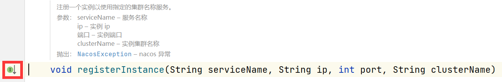

# Nacos源码(一)

​	因为最近项目在做容器化处理，容器化后涉及到不同进程对同一个文件的读写，考虑到可能会存在同一文件的配置文件，可能会把彼此覆盖掉，所以这里学习一下Nacos源码。

## 整体结构图

​	这边主要看配置中心、服务注册中心的源码，其他也会说，但不会那么细致。


## 源码解析

### 配置服务源码

​	这一块源码，我们从nacos的测试的demo入手进行学习，先总概整体过程再拆分出来一个个剖析。

* 先找到ConfigExample，配置服务示例（建议起一个Nacos服务，对着学源码），重点看下以下代码
  * 获取配置文件过程：使用nacos地址--->获取配置对象--->使用配置对象、文件名、组名获取配置信息
  * 设置监听器：使用配置对象、文件名、组名配置--->必须重写两方法
  * 更新配置信息：使用配置对象，把文件名、组名给上即可
  * 删除配置：使用配置对象，把文件名、组名给上即可

```java
public class ConfigExample {
    public static void main(String[] args) throws NacosException, InterruptedException {
        //*************获取配置信息****************
        String serverAddr = "localhost";  //设置nacos的地址
        String dataId = "test"; //文件名或者叫id也可以
        String group = "DEFAULT_GROUP"; //对应的组
        Properties properties = new Properties();//创造一个配置类
        properties.put("serverAddr", serverAddr);//将nacos服务地址设置进去
        //使用Nacos的ip地址，创建nacos配置服务对象（后面细说）
        ConfigService configService = NacosFactory.createConfigService(properties);
       //从配置服务对象获取配置内容（传入文件名、组名、超时时间）
        String content = configService.getConfig(dataId, group, 5000);
        System.out.println(content); //拿到的配置内容
       	//*************增加服务配置的监听器****************
        configService.addListener(dataId, group, new Listener() {
            //输出配置信息
            @Override
            public void receiveConfigInfo(String configInfo) {
                System.out.println("receive:" + configInfo);
            }
           
            //可以获取线程，当坚挺到配置的时候，执行某些任务
            @Override
            public Executor getExecutor() {
                return null;
            }
        });
		//*************推送新配置信息****************
        //判断推送是否成功
        boolean isPublishOk = configService.publishConfig(dataId, group, "content");
        System.out.println(isPublishOk);
		
        //*************获取新的配置信息****************
        Thread.sleep(3000);
        content = configService.getConfig(dataId, group, 5000);
        System.out.println(content);
		
        //*************获取新的配置信息****************
        boolean isRemoveOk = configService.removeConfig(dataId, group);
        System.out.println(isRemoveOk);
        Thread.sleep(3000);
		
        //再次获取配置信息确保已经删除
        content = configService.getConfig(dataId, group, 5000);
        System.out.println(content);
        Thread.sleep(300000);
    }
}
```

下面把上面的部分拆开细讲。

#### 获取配置文件

* ctrl+鼠标左键点击getConfig进入源码查看

```java
        Thread.sleep(3000);
        content = configService.getConfig(dataId, group, 5000);
        System.out.println(content);
```

* 点击查看实现类


* 进入getConfigInner进去继续查看

```java
    @Override
    public String getConfig(String dataId, String group, long timeoutMs) throws NacosException {
        return getConfigInner(namespace, dataId, group, timeoutMs);
    }
```

* 开始剖析getConfigInner，直接看注释即可
  * 特别注意下：tenant和namespace是一个东西，从nacos的显示的日志可以看出。
  * 整个过程如下：

>* 先从本地磁盘中加载配置，因为应用在启动时，会加载远程配置缓存到本地，如果本地文件的内容不为空，直接返回。
>* 如果本地文件的内容为空，则调用worker.getServerConfig加载远程配置
>* 如果出现异常，则调用本地快照文件加载配置

```java
    private String getConfigInner(String tenant, String dataId, String group, long timeoutMs) throws NacosException {
        //判断group是否为空，为空则设为默认
        group = blank2defaultGroup(group);
        //校验dataId、group保证不为空
        ParamUtils.checkKeyParam(dataId, group);
        //创建配置响应对象
        ConfigResponse cr = new ConfigResponse();
        
    	//设置文件id、命名空间、组
        cr.setDataId(dataId);
        cr.setTenant(tenant);
        cr.setGroup(group);
        
        //优先加载本地配置
        String content = LocalConfigInfoProcessor.getFailover(worker.getAgentName(), dataId, group, tenant);
        if (content != null) {
            //如果本地内容不为空，则告知从本地加载成功（后面细说）
            LOGGER.warn("[{}] [get-config] get failover ok, dataId={}, group={}, tenant={}, config={}",
                    worker.getAgentName(), dataId, group, tenant, ContentUtils.truncateContent(content));
           //将加载到的内容放入配置对象
            cr.setContent(content);
            //获取容灾配置的EncryptedDataKey
            String encryptedDataKey = LocalEncryptedDataKeyProcessor
                    .getEncryptDataKeyFailover(agent.getName(), dataId, group, tenant);
            //放入容灾配置的EncryptedDataKey
            cr.setEncryptedDataKey(encryptedDataKey);
            //过滤链
            configFilterChainManager.doFilter(null, cr);
            //从响应对象重新获取配置内容
            content = cr.getContent();
            //返回配置内容
            return content;
        }
        
        try {
            //加载远程配置，获取配置对象（后面细说）
            ConfigResponse response = worker.getServerConfig(dataId, group, tenant, timeoutMs, false);
            //从远程配置里获取配置内容，并设置
            cr.setContent(response.getContent());
            //从配置响应对象获取EncryptedDataKey，并设置EncryptedDataKey
            cr.setEncryptedDataKey(response.getEncryptedDataKey());
            //过滤链
            configFilterChainManager.doFilter(null, cr);
            //从响应对象重新获取配置内容
            content = cr.getContent();
            //返回配置内容
            return content;
        } catch (NacosException ioe) {
            //出现问题的情况：
            //请求失败、配置正在被删除、配置已不存在
            if (NacosException.NO_RIGHT == ioe.getErrCode()) {
                throw ioe;
            }
            LOGGER.warn("[{}] [get-config] get from server error, dataId={}, group={}, tenant={}, msg={}",
                    worker.getAgentName(), dataId, group, tenant, ioe.toString());
        }
        
        LOGGER.warn("[{}] [get-config] get snapshot ok, dataId={}, group={}, tenant={}, config={}",
                worker.getAgentName(), dataId, group, tenant, ContentUtils.truncateContent(content));
        //从快照中获取（后面细说，在快照加载部分）
        content = LocalConfigInfoProcessor.getSnapshot(worker.getAgentName(), dataId, group, tenant);
        //放入获取到的配置内容
        cr.setContent(content);
        //获取encryptedDataKey
        String encryptedDataKey = LocalEncryptedDataKeyProcessor
                .getEncryptDataKeyFailover(agent.getName(), dataId, group, tenant);
        //向配置响应对象里放入encryptedDataKey
        cr.setEncryptedDataKey(encryptedDataKey);
        //过滤链
        configFilterChainManager.doFilter(null, cr);
        //重新获取配置内容
        content = cr.getContent();
        //返回配置内容
        return content;
    }

```

##### 本地配置加载

* 从getFailover进入查看本地配置源码

```java
        // use local config first
        String content = LocalConfigInfoProcessor.getFailover(worker.getAgentName(), dataId, group, tenant);
```

* 进入getFailover查看
  * 获取本地配置地址，根据命名空间进行拼串
    * 没有命名空间：/${serverName}_nacos/data/config-data
    * 存在命名空间：/${serverName}_nacos/data/config-data-tenant/${tenant}
  * 进入readFile，继续查看

```java
    public static String getFailover(String serverName, String dataId, String group, String tenant) {
        File localPath = getFailoverFile(serverName, dataId, group, tenant);
        if (!localPath.exists() || !localPath.isFile()) {
            //如果文件不存在则返空
            return null;
        }        
        try {
            //读取文件
            return readFile(localPath);
        } catch (IOException ioe) {
            LOGGER.error("[" + serverName + "] get failover error, " + localPath, ioe);
            return null;
        }
    }
```

* 进入readFile方法继续查看

```java
    protected static String readFile(File file) throws IOException {
        if (!file.exists() || !file.isFile()) {
            //判断文件路径对应的文件是否存在，不存在则返空
            return null;
        }
        //判断是否为多实例，多实例则采取文件锁获取
        if (JvmUtil.isMultiInstance()) {
            return ConcurrentDiskUtil.getFileContent(file, Constants.ENCODE);
        } else {//否则使用正常的文件打开方式读取配置即可
            try (InputStream is = new FileInputStream(file)) {
                return IoUtils.toString(is, Constants.ENCODE);
            }
        }
    }
```

* 进入getFileContent方法查看

```java
    public static String getFileContent(File file, String charsetName) throws IOException {
        RandomAccessFile fis = null; //创建一个随机流
        FileLock rlock = null;	//创建一个文件锁
        try {
            //因为只读取配置，所以权限为“只读”
            fis = new RandomAccessFile(file, READ_ONLY);
            FileChannel fcin = fis.getChannel();
            int i = 0;
            do {
                try {
                    //尝试获取该文件的文件锁，如果获取不到则返回null
                    rlock = fcin.tryLock(0L, Long.MAX_VALUE, true);
                } catch (Exception e) {
                    //没有获取到则抛出异常
                    ++i;
                    //如果尝试10次还获取不到锁则抛出异常
                    if (i > RETRY_COUNT) {
                        LOGGER.error("read {} fail;retryed time:{}", file.getName(), i);
                        throw new IOException("read " + file.getAbsolutePath() + " conflict");
                    }
                    //休眠10ms*次数
                    sleep(SLEEP_BASETIME * i);
                    LOGGER.warn("read {} conflict;retry time:{}", file.getName(), i);
                }
            } while (null == rlock);//自旋锁，一直尝试获取锁
            //获取当前通道大小
            int fileSize = (int) fcin.size();
            //创建缓冲区
            ByteBuffer byteBuffer = ByteBuffer.allocate(fileSize);
            //把字节读入
            fcin.read(byteBuffer);
            //刷新缓冲区
            byteBuffer.flip();
            //将缓冲区字节转换为字符串
            return byteBufferToString(byteBuffer, charsetName);
        } finally {
            if (rlock != null) {
                //释放锁
                rlock.release();
                rlock = null;
            }
            if (fis != null) {
               //关闭流
                IoUtils.closeQuietly(fis);
                fis = null;
            }
        }
    }

```

##### 远程配置加载

​	触发远程配置加载的情况是，本地配置文件为空，则会从远程中心去调用：

```java
    public ConfigResponse getServerConfig(String dataId, String group, String tenant, long readTimeout, boolean notify)
            throws NacosException {
        if (StringUtils.isBlank(group)) {
        	//判断组是否为空，为空则使用默认组名
            group = Constants.DEFAULT_GROUP;
        } 
        	//使用配置id、组名、命名空间、超时时间和是否使用缓存
        return this.agent.queryConfig(dataId, group, tenant, readTimeout, notify);
    }
```

* 进入queryConfig方法继续查看
  * 如果notify为true，则会从缓存里找到对应的缓存数据，使用缓存数据去获取先前加载过这个配置的客户端。

```java
        @Override
        public ConfigResponse queryConfig(String dataId, String group, String tenant, long readTimeouts, boolean notify)
                throws NacosException {
            //使用文件id、组名、命名空间生成请求
            ConfigQueryRequest request = ConfigQueryRequest.build(dataId, group, tenant);
            //把notify放入请求的头部信息中
            request.putHeader(NOTIFY_HEADER, String.valueOf(notify));
            //以0位id，获取一个正在运行的客户端
            RpcClient rpcClient = getOneRunningClient();
            if (notify) {
            //查看notify是否为true，为true则从缓存里获取对应客户端
                CacheData cacheData = cacheMap.get().get(GroupKey.getKeyTenant(dataId, group, tenant));
                if (cacheData != null) {
                    //如果缓存不为空，则获取数据对应存储的客户端使用
                    rpcClient = ensureRpcClient(String.valueOf(cacheData.getTaskId()));
                }
            }
            //获取查询响应对象
            ConfigQueryResponse response = (ConfigQueryResponse) requestProxy(rpcClient, request, readTimeouts);
            //创建配置对象
            ConfigResponse configResponse = new ConfigResponse();
            if (response.isSuccess()) {
                //如果响应成功，则将其存储到快照中（执行逻辑：拿组名、命名空间、文件id去查询）（细说saveSnapshot）
                //1、首先获取快照文件（是否存在命名空间）	
                // 不存在命名空间：/config_rpc_client_nacos/snapshot/${group}/${dataId}
                //	存在命名空间：/config_rpc_client_nacos/snapshot-tenant/${tenant}/${group}/${dataId}
                LocalConfigInfoProcessor.saveSnapshot(this.getName(), dataId, group, tenant, response.getContent());
                //将文件内容置入
                configResponse.setContent(response.getContent());
                //初始化配置类型
                String configType;
                //判断响应实体里的文本类型是否为空
                if (StringUtils.isNotBlank(response.getContentType())) {
                    //不为空则从响应体获取文件类型
                    configType = response.getContentType();
                } else {
                    //如果响应体没有设置文件类型，则设置为TEXT
                    configType = ConfigType.TEXT.getType();
                }
                	//将配置文件类型给上
                configResponse.setConfigType(configType);
                	//获取encryptedDataKey（理解成一个秘钥就可以）
                String encryptedDataKey = response.getEncryptedDataKey();
                	//保存快照，内容为空则删除
                LocalEncryptedDataKeyProcessor
                        .saveEncryptDataKeySnapshot(agent.getName(), dataId, group, tenant, encryptedDataKey);
               		//把encryptedDataKey设置进去
                configResponse.setEncryptedDataKey(encryptedDataKey);
                	//返回响应结果
                return configResponse;
                //错误码300，此时配置为null，删除同名的快照，如果快照不存在，则报错。（细说saveSnapshot）
            } else if (response.getErrorCode() == ConfigQueryResponse.CONFIG_NOT_FOUND) {
                LocalConfigInfoProcessor.saveSnapshot(this.getName(), dataId, group, tenant, null);
                LocalEncryptedDataKeyProcessor.saveEncryptDataKeySnapshot(agent.getName(), dataId, group, tenant, null);
                return configResponse;
                //错误码400，直接抛异常
            } else if (response.getErrorCode() == ConfigQueryResponse.CONFIG_QUERY_CONFLICT) {
                LOGGER.error(
                        "[{}] [sub-server-error] get server config being modified concurrently, dataId={}, group={}, "
                                + "tenant={}", this.getName(), dataId, group, tenant);
                throw new NacosException(NacosException.CONFLICT,
                        "data being modified, dataId=" + dataId + ",group=" + group + ",tenant=" + tenant);
            } else {
                //其他的，也直接抛异常
                LOGGER.error("[{}] [sub-server-error]  dataId={}, group={}, tenant={}, code={}", this.getName(), dataId,
                        group, tenant, response);
                throw new NacosException(response.getErrorCode(),
                        "http error, code=" + response.getErrorCode() + ",msg=" + response.getMessage() + ",dataId=" + dataId + ",group=" + group
                                + ",tenant=" + tenant);
                
            }
        }
```

* 细说一下快照存储的过程
  * 不存在命名空间：/config_rpc_client_nacos/snapshot/${group}/${dataId}
  * 存在命名空间：/config_rpc_client_nacos/snapshot-tenant/${tenant}/${group}/${dataId}

```java
    public static void saveSnapshot(String envName, String dataId, String group, String tenant, String config) {
        //查看是否开启快照功能，没有则直接返回
        if (!SnapShotSwitch.getIsSnapShot()) {
            return;
        }
        //获取路径
        //不存在命名空间：/config_rpc_client_nacos/snapshot/${group}/${dataId}
		//存在命名空间：/config_rpc_client_nacos/snapshot-tenant/${tenant}/${group}/${dataId}
        File file = getSnapshotFile(envName, dataId, group, tenant);
        if (null == config) { //如果传入的配置文件内容为空
            try {
                //删除这个配置文件
                IoUtils.delete(file);
            } catch (IOException ioe) {
                LOGGER.error("[" + envName + "] delete snapshot error, " + file, ioe);
            }
        } else {
            try {
                //获取父类目录
                File parentFile = file.getParentFile();
                //如果父类目录不存在
                if (!parentFile.exists()) {
                    //新建目录
                    boolean isMdOk = parentFile.mkdirs();
                    //如果新建目录失败
                    if (!isMdOk) {
                    //新建目录出错
                        LOGGER.error("[{}] save snapshot error", envName);
                    }
                }
                
                if (JvmUtil.isMultiInstance()) {
                    //如果是多实例，使用文件锁将配置文件写入文件（下面细说）
                    ConcurrentDiskUtil.writeFileContent(file, config, Constants.ENCODE);
                } else {
                   //如果是单实例，直接写入
                    IoUtils.writeStringToFile(file, config, Constants.ENCODE);
                }
            } catch (IOException ioe) {
                LOGGER.error("[" + envName + "] save snapshot error, " + file, ioe);
            }
        }
    }
```

* 进入writeFileContent进行查看

```java
    public static Boolean writeFileContent(File file, String content, String charsetName) throws IOException {
        //如果文件不存在
        if (!file.exists()) {
            //创建文件，返回失败结果
            boolean isCreateOk = file.createNewFile();
            if (!isCreateOk) {
                return false;
            }
        }
        //初始化信道，文件锁，随机流
        FileChannel channel = null;
        FileLock lock = null;
        RandomAccessFile raf = null;
        try {
            //随机流读取文件，给与读和写的权限
            raf = new RandomAccessFile(file, READ_WRITE);
            //获取信道
            channel = raf.getChannel();
            //初始化获取锁的次数
            int i = 0;
            do {
                try {
                    //尝试获取锁
                    lock = channel.tryLock();
                } catch (Exception e) {
                    ++i;//获取锁的次数+1
                    //获取次数高于10次报错
                    if (i > RETRY_COUNT) {
                        LOGGER.error("write {} fail;retryed time:{}", file.getName(), i);
                        throw new IOException("write " + file.getAbsolutePath() + " conflict");
                    }
                    //休眠，防止进程里的线程占用过高，导致cpu爆满
                    sleep(SLEEP_BASETIME * i);
                    LOGGER.warn("write {} conflict;retry time:{}", file.getName(), i);
                }
            } while (null == lock);
            //将配置文件内容压到缓冲区
            ByteBuffer sendBuffer = ByteBuffer.wrap(content.getBytes(charsetName));
            //将其通过信道写入
            while (sendBuffer.hasRemaining()) {
                channel.write(sendBuffer);
            }
            channel.truncate(content.length());
        } catch (FileNotFoundException e) {
            throw new IOException("file not exist");
        } finally {
            if (lock != null) {
                try {
                    lock.release();
                    lock = null;
                } catch (IOException e) {
                    LOGGER.warn("close wrong", e);
                }
            }
            if (channel != null) {
                try {
                    channel.close();
                    channel = null;
                } catch (IOException e) {
                    LOGGER.warn("close wrong", e);
                }
            }
            if (raf != null) {
                try {
                    raf.close();
                    raf = null;
                } catch (IOException e) {
                    LOGGER.warn("close wrong", e);
                }
            }
            
        }
        return true;
    }
```

##### 使用快照加载

* 从getSnapshot进入快照获取配置文件的源码中

```java
    public static String getSnapshot(String name, String dataId, String group, String tenant) {
        //如果没有开启快照，则直接返空
        if (!SnapShotSwitch.getIsSnapShot()) {
            return null;
        }
		//获取路径
        //不存在命名空间：/config_rpc_client_nacos/snapshot/${group}/${dataId}
        //存在命名空间：/config_rpc_client_nacos/snapshot-tenant/${tenant}/${group}/${dataId}
        File file = getSnapshotFile(name, dataId, group, tenant);
        //如果文件不存在或者不是文件，则直接返空
        if (!file.exists() || !file.isFile()) {
            return null;
        }
        try {
            //读文件入口
            return readFile(file);
        } catch (IOException ioe) {
            LOGGER.error("[" + name + "]+get snapshot error, " + file, ioe);
            return null;
        }
    }

```

* readFile这个方法讲过了，返回本地配置加载的readFile方法查看即可。

至此，Nacos的配置文件获取源码就讲完了。

#### 删除配置文件

* 删除配置文件的入口

```java
boolean isRemoveOk = configService.removeConfig(dataId, group);
```

* 一路追踪到removeConfig


* 查看配置移除的代码

```java
        @Override
        public boolean removeConfig(String dataId, String group, String tenant, String tag) throws NacosException {
            //新建一个删除配置请求的实体，传入文件Id，组名、命名空间
            ConfigRemoveRequest request = new ConfigRemoveRequest(dataId, group, tenant, tag);
            //使用网关发起请求
            ConfigRemoveResponse response = (ConfigRemoveResponse) requestProxy(getOneRunningClient(), request);	
            //返回响应结果
            return response.isSuccess();
        }
```

#### 更新配置文件

* 从先前的demo一路追到publishConfig


* 进入publishConfig查看

```java
    private boolean publishConfigInner(String tenant, String dataId, String group, String tag, String appName,
            String betaIps, String content, String type, String casMd5) throws NacosException {
        //查看组名是否为空，为空则使用DEFAULT_GROUP为默认组名
        group = blank2defaultGroup(group);
        //校验文件id，组名和配置文件内容
        ParamUtils.checkParam(dataId, group, content);
        //初始化配置文件实体
        ConfigRequest cr = new ConfigRequest();
        //放入文件id、组名、命名空间、类型等
        cr.setDataId(dataId);
        cr.setTenant(tenant);
        cr.setGroup(group);
        cr.setContent(content);
        cr.setType(type);
        //过滤链
        configFilterChainManager.doFilter(cr, null);
        //重新获取配置文件内容
        content = cr.getContent();
        //获取秘钥
        String encryptedDataKey = (String) cr.getParameter("encryptedDataKey");
        return worker
                .publishConfig(dataId, group, tenant, appName, tag, betaIps, content, encryptedDataKey, casMd5, type);
    }
```

* 从worker的publishConfig一路追到代理的实现


* 进入publishConfig查看

```java
        @Override
        public boolean publishConfig(String dataId, String group, String tenant, String appName, String tag,
                String betaIps, String content, String encryptedDataKey, String casMd5, String type)
                throws NacosException {
            try {
                //将要更新的内容，文件id，组名，命名空间放入请求中
                ConfigPublishRequest request = new ConfigPublishRequest(dataId, group, tenant, content);
                //设置请求需要的各种参数，例如文件类型等
                request.setCasMd5(casMd5);
                request.putAdditionalParam(TAG_PARAM, tag);
                request.putAdditionalParam(APP_NAME_PARAM, appName);
                request.putAdditionalParam(BETAIPS_PARAM, betaIps);
                request.putAdditionalParam(TYPE_PARAM, type);
                request.putAdditionalParam(ENCRYPTED_DATA_KEY_PARAM, encryptedDataKey);
                //使用网关发送请求
                ConfigPublishResponse response = (ConfigPublishResponse) requestProxy(getOneRunningClient(), request);
                //请求如果不成功返回false
                if (!response.isSuccess()) {
                    LOGGER.warn("[{}] [publish-single] fail, dataId={}, group={}, tenant={}, code={}, msg={}",
                            this.getName(), dataId, group, tenant, response.getErrorCode(), response.getMessage());
                    return false;
                } else {
                    //成功返回true
                    LOGGER.info("[{}] [publish-single] ok, dataId={}, group={}, tenant={}, config={}", getName(),
                            dataId, group, tenant, ContentUtils.truncateContent(content));
                    return true;
                }
            } catch (Exception e) {
                LOGGER.warn("[{}] [publish-single] error, dataId={}, group={}, tenant={}, code={}, msg={}",
                        this.getName(), dataId, group, tenant, "unkonw", e.getMessage());
                return false;
            }
        }
```

 

### 服务注册源码

​	老规矩，先找到nacos源码中的demo：nacos-example，找到nacos-example模块下的App这个案例：


* 从实例注册registerInstance进入：传入服务名称、ip、端口号、实例的集群名称。

```java
public class App {
    public static void main(String[] args) throws NacosException {
        Properties properties = new Properties();
        properties.setProperty("serverAddr", "21.34.53.5:8848,21.34.53.6:8848");
        properties.setProperty("namespace", "quickStart");
        NamingService naming = NamingFactory.createNamingService(properties);
        naming.registerInstance("nacos.test.3", "11.11.11.11", 8888, "TEST1");
        naming.registerInstance("nacos.test.3", "2.2.2.2", 9999, "DEFAULT");
        System.out.println(naming.getAllInstances("nacos.test.3"));
    }
}
```

* 从该接口进入，一路找到具体的实现方法：



* 创造实例，传入ip，端口号，实例的权重和集群名称，使用服务名，组名，实例，注册。

```java
    public void registerInstance(String serviceName, String groupName, String ip, int port, String clusterName)
            throws NacosException {
        Instance instance = new Instance();
        instance.setIp(ip);
        instance.setPort(port);
        instance.setWeight(1.0);
        instance.setClusterName(clusterName);
        registerInstance(serviceName, groupName, instance);
    }
```

* ​	进入registerInstance，发现使用clientProxy注册服务，查看接口：

```java
    @Override
    public void registerInstance(String serviceName, String groupName, Instance instance) throws NacosException {
        NamingUtils.checkInstanceIsLegal(instance);
        clientProxy.registerService(serviceName, groupName, instance);
    }
```

* 进入registerService方法：包含注册、注销、更新、查询、订阅、取消订阅

```java
public interface NamingClientProxy extends Closeable {
    
    /**使用指定的实例属性注册实例以提供服务。
     * Register a instance to service with specified instance properties.
     *
     * @param serviceName name of service
     * @param groupName   group of service
     * @param instance    instance to register
     * @throws NacosException nacos exception
     */
    void registerService(String serviceName, String groupName, Instance instance) throws NacosException;
    
    /**从服务中注销实例。
     * Deregister instance from a service.
     *
     * @param serviceName name of service
     * @param groupName   group name
     * @param instance    instance
     * @throws NacosException nacos exception
     */
    void deregisterService(String serviceName, String groupName, Instance instance) throws NacosException;
    
    /**将实例更新为服务。
     * Update instance to service.
     *
     * @param serviceName service name
     * @param groupName   group name
     * @param instance    instance
     * @throws NacosException nacos exception
     */
    void updateInstance(String serviceName, String groupName, Instance instance) throws NacosException;
    
    /**
     * 查询实例列表。
     *
     * @param serviceName service name
     * @param groupName   group name
     * @param clusters    clusters
     * @param udpPort     udp port
     * @param healthyOnly healthy only
     * @return service info
     * @throws NacosException nacos exception
     */
    ServiceInfo queryInstancesOfService(String serviceName, String groupName, String clusters, int udpPort, boolean healthyOnly)
            throws NacosException;
    
    /**
     * 查询服务。
     *
     * @param serviceName service name
     * @param groupName   group name
     * @return service
     * @throws NacosException nacos exception
     */
    Service queryService(String serviceName, String groupName) throws NacosException;
    
    /**
     * 创建服务。
     *
     * @param service  service
     * @param selector selector
     * @throws NacosException nacos exception
     */
    void createService(Service service, AbstractSelector selector) throws NacosException;
    
    /**
     * 删除服务。
     *
     * @param serviceName service name
     * @param groupName   group name
     * @return true if delete ok
     * @throws NacosException nacos exception
     */
    boolean deleteService(String serviceName, String groupName) throws NacosException;
    
    /**
     * 更新服务。
     *
     * @param service  service
     * @param selector selector
     * @throws NacosException nacos exception
     */
    void updateService(Service service, AbstractSelector selector) throws NacosException;
    
    /**获取服务列表。
     * Get service list.
     *
     * @param pageNo    page number
     * @param pageSize  size per page
     * @param groupName group name of service
     * @param selector  selector
     * @return list of service
     * @throws NacosException nacos exception
     */
    ListView<String> getServiceList(int pageNo, int pageSize, String groupName, AbstractSelector selector)
            throws NacosException;
    
    /**订阅服务。
     * Subscribe service.
     *
     * @param serviceName service name
     * @param groupName   group name
     * @param clusters    clusters, current only support subscribe all clusters, maybe deprecated
     * @return current service info of subscribe service
     * @throws NacosException nacos exception
     */
    ServiceInfo subscribe(String serviceName, String groupName, String clusters) throws NacosException;
    
    /**退订服务。
     * Unsubscribe service.
     *
     * @param serviceName service name
     * @param groupName   group name
     * @param clusters    clusters, current only support subscribe all clusters, maybe deprecated
     * @throws NacosException nacos exception
     */
    void unsubscribe(String serviceName, String groupName, String clusters) throws NacosException;
    
    /**判断服务是否已订阅
     * Judge whether service has been subscribed.
     *
     * @param serviceName service name
     * @param groupName   group name
     * @param clusters    clusters, current only support subscribe all clusters, maybe deprecated
     * @return {@code true} if subscribed, otherwise {@code false}
     * @throws NacosException nacos exception
     */
    boolean isSubscribed(String serviceName, String groupName, String clusters) throws NacosException;
    
    /**更新节拍信息。
     * Update beat info.
     *
     * @param modifiedInstances modified instances
     */
    void updateBeatInfo(Set<Instance> modifiedInstances);
    
    /**检查服务器是否健康。
     * Check Server healthy.
     *
     * @return true if server is healthy
     */
    boolean serverHealthy();
}
```

到这里，就是所有服务注册可使用的API了，这里先不管，专注服务注册来看。

#### 服务注册

​	服务注册

```java
    public void registerService(String serviceName, String groupName, Instance instance) throws NacosException {
        //输出命名空间id和服务名，以及实体对象
        NAMING_LOGGER.info("[REGISTER-SERVICE] {} registering service {} with instance: {}", namespaceId, serviceName,instance);
        //判断服务名、组名是否为空，为空则异常，不为空则组名+@@+服务名。使用intern方法，返回常量池中的
        String groupedServiceName = NamingUtils.getGroupedName(serviceName, groupName);
        //判断服务是否为短暂
        if (instance.isEphemeral()) {
            BeatInfo beatInfo = beatReactor.buildBeatInfo(groupedServiceName, instance);
            beatReactor.addBeatInfo(groupedServiceName, beatInfo);
        }
        //如果不是短暂服务，则把各种属性填入map中
        final Map<String, String> params = new HashMap<String, String>(32);
        //命名空间id
        params.put(CommonParams.NAMESPACE_ID, namespaceId);
        //服务的组名
        params.put(CommonParams.SERVICE_NAME, groupedServiceName);
        //组名
        params.put(CommonParams.GROUP_NAME, groupName);
        //集群名
        params.put(CommonParams.CLUSTER_NAME, instance.getClusterName());
        //从实体获取ip
        params.put(IP_PARAM, instance.getIp());
        //获取端口号
        params.put(PORT_PARAM, String.valueOf(instance.getPort()));
        //获取权重
        params.put(WEIGHT_PARAM, String.valueOf(instance.getWeight()));
        //是否启用
        params.put("enable", String.valueOf(instance.isEnabled()));
        //健康状况
        params.put(HEALTHY_PARAM, String.valueOf(instance.isHealthy()));
        //实例是否是短暂的，到这里，正常情况下应该不是短暂的了
        params.put(EPHEMERAL_PARAM, String.valueOf(instance.isEphemeral()));
        //元数据，或者叫用户扩展数据
        params.put(META_PARAM, JacksonUtils.toJson(instance.getMetadata()));
        // /nacos/v1/ns/instance，将配置塞入，放入请求类型
        reqApi(UtilAndComs.nacosUrlInstance, params, HttpMethod.POST);
    }   
```

* 进入reqApi方法继续查看

```java
    public String reqApi(String api, Map<String, String> params, String method) throws NacosException {
        //传入 /nacos/v1/ns/instance，空map，方法
        return reqApi(api, params, Collections.EMPTY_MAP, method);
    }
```

* 在进入下一层reqApi查看

```java
public String reqApi(String api, Map<String, String> params, Map<String, String> body, String method)
        throws NacosException {
    //传入 /nacos/v1/ns/instance，空map，服务列表，方法名
    return reqApi(api, params, body, serverListManager.getServerList(), method);
}
```

* 最终，reqApi调用方法

```java
//获取服务失败，醋粗    public String reqApi(String api, Map<String, String> params, Map<String, String> body, List<String> servers,String method) throws NacosException {
        //存入命名空间id
        params.put(CommonParams.NAMESPACE_ID, getNamespaceId());
  		//如果服务列表为空并且服务管理器域名为空
        if (CollectionUtils.isEmpty(servers) && !serverListManager.isDomain()) {
            throw new NacosException(NacosException.INVALID_PARAM, "no server available");
        }	
        //创建nacos异常
        NacosException exception = new NacosException();
        
        if (serverListManager.isDomain()) {//如果服务列表管理器为空
            //从服务管理器中获取nacos域名
            String nacosDomain = serverListManager.getNacosDomain();
            for (int i = 0; i < maxRetry; i++) {
                try {
                 //（重点！）传入/nacos/v1/ns/instance，配置（命名空间、集群名等），nacosDomain是http或https
                 //空map，http请求方式（post或get等）
                    return callServer(api, params, body, nacosDomain, method);
                } catch (NacosException e) {
                    //防止nacos找不到连接异常
                    exception = e;
                    if (NAMING_LOGGER.isDebugEnabled()) {
                        NAMING_LOGGER.debug("request {} failed.", nacosDomain, e);
                    }
                }
            }
        } else {
            //如果服务列表管理器不为空，从服务列表中生成一个随机服务
            Random random = new Random(System.currentTimeMillis());
            int index = random.nextInt(servers.size());
    		//遍历服务，获取随机服务
            for (int i = 0; i < servers.size(); i++) {
               //server里存的是调用网址https或者http，可带端口，也可不带（甚至可以只有地址）
                String server = servers.get(index);
                try {
               //调用callServer（重点）
                    return callServer(api, params, body, server, method);
                } catch (NacosException e) {
                    exception = e;
                    if (NAMING_LOGGER.isDebugEnabled()) {
                        NAMING_LOGGER.debug("request {} failed.", server, e);
                    }
                }
                //取下一个服务
                index = (index + 1) % servers.size();
            }
        }	
        //获取服务失败，服务名，错误代码，错误日志
        NAMING_LOGGER.error("request: {} failed, servers: {}, code: {}, msg: {}", api, servers, exception.getErrCode(), exception.getErrMsg());
        throw new NacosException(exception.getErrCode(),"failed to req API:" + api + " after all servers(" + servers + ") tried: " + exception.getMessage());
    }
```

* 说一下整个服务注册里最重要的方法callServer

```java
    public String callServer(String api, Map<String, String> params, Map<String, String> body, String curServer,String method) throws NacosException {
        //获取当前时间
        long start = System.currentTimeMillis();
        long end = 0;
        //获取nacos安全令牌，用于访问nacos（accessToken）
        params.putAll(getSecurityHeaders());
        //存入服务名serviceName
        params.putAll(getSpasHeaders(params.get(SERVICE_NAME_PARAM)));
        //构建请求头：包含服务端版本号，用户代理，请求资源，请求提类型、请求体长度、编码类型等
        Header header = NamingHttpUtil.builderHeader();
        
        String url;
        //这里就开始进行拼串了
        //如果是https：或http开头
        if (curServer.startsWith(UtilAndComs.HTTPS) || curServer.startsWith(UtilAndComs.HTTP)) {
            //	http://127.0.0.1:8848/nacos/ + api
            url = curServer + api;
        } else {
            if (!InternetAddressUtil.containsPort(curServer)) {//如果连端口都没包含
                // 127.0.0.1 + : +8848
                curServer = curServer + InternetAddressUtil.IP_PORT_SPLITER + serverPort;
            }
            //	http:// + 127.0.0.1:8848 + /nacos/api
            url = NamingHttpClientManager.getInstance().getPrefix() + curServer + api;
        }
        
        try {
            //发送请求，返回请求结果（重点）
            HttpRestResult<String> restResult = nacosRestTemplate
                    .exchangeForm(url, header, Query.newInstance().initParams(params), body, method, String.class);
            //响应的时间
            end = System.currentTimeMillis();
            //指标监视器，传入方法，传入使用时间
            MetricsMonitor.getNamingRequestMonitor(method, url, String.valueOf(restResult.getCode()))
                    .observe(end - start);
            //回传的代码为200
            if (restResult.ok()) {
                return restResult.getData();
            }
            //如果状态码为304，则返回空
            if (HttpStatus.SC_NOT_MODIFIED == restResult.getCode()) {
                return StringUtils.EMPTY;
            }
            //抛出异常
            throw new NacosException(restResult.getCode(), restResult.getMessage());
        } catch (Exception e) {
            NAMING_LOGGER.error("[NA] failed to request", e);
            throw new NacosException(NacosException.SERVER_ERROR, e);
        }
    }
```

* 上面已经把nacos的服务注册全部流程写完了，但，可以再讲细点，进入nacosRestTemplate的exchangeForm方法查看

```java
    public <T> HttpRestResult<T> exchangeForm(String url, Header header, Query query, Map<String, String> bodyValues,String httpMethod, Type responseType) throws Exception {
       //封装hhtp请求头，将url，请求头参数，参数寻参数，请求体，http类型等放入
        RequestHttpEntity requestHttpEntity = new RequestHttpEntity(
                header.setContentType(MediaType.APPLICATION_FORM_URLENCODED), query, bodyValues);
        //传入url，请求方法。请求体，请求类型，最后发送给nacos获取请求结果
        return execute(url, httpMethod, requestHttpEntity, responseType);
    }
```

至此，nacos服务注册源码已经全部整理完毕，下一次来讲一讲sofa，或者把nacos的其他方法讲讲。
