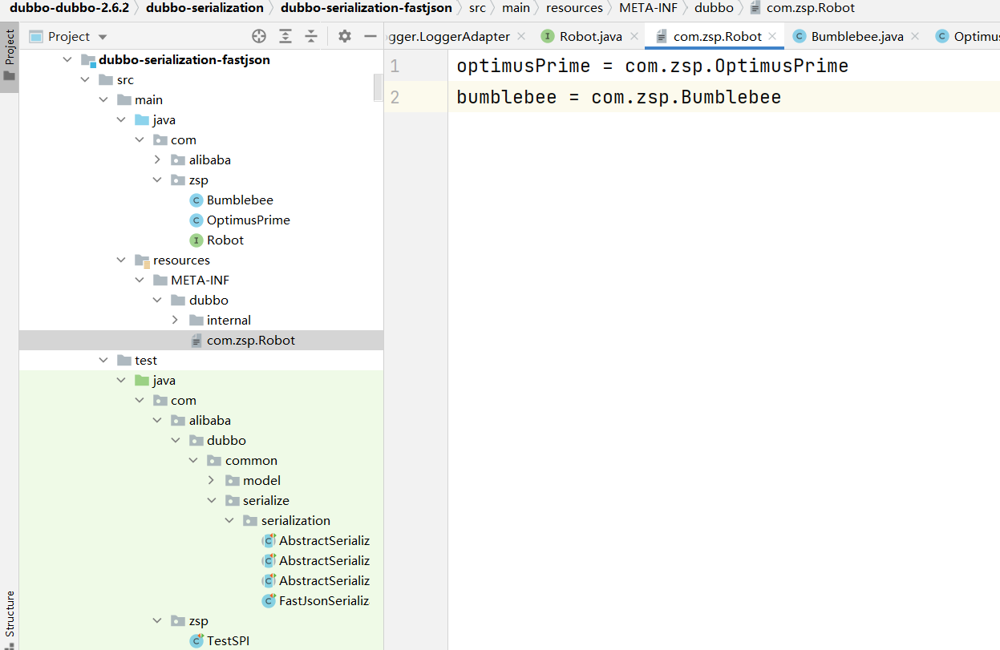
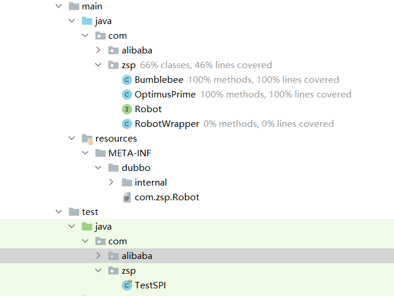
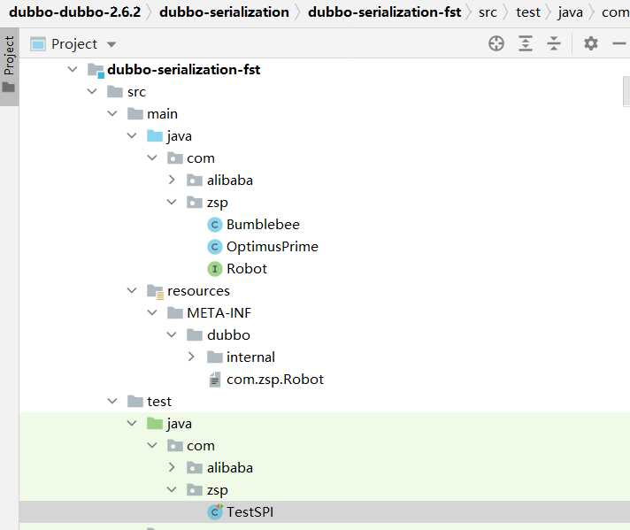
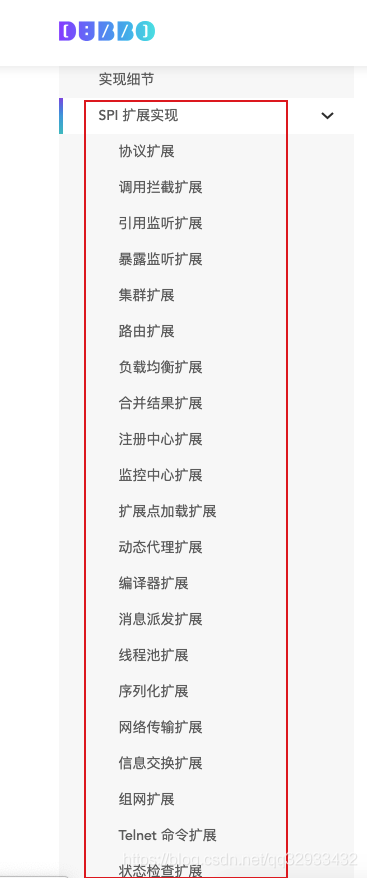
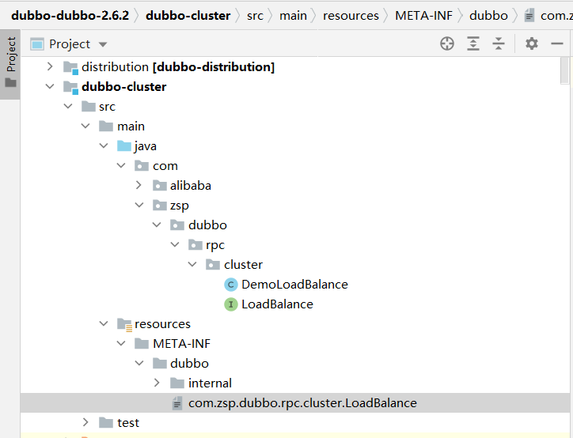

# Dubbo SPI源码

​	Dubbo SPI，是Java SPI的优化版本，前面我们说过，Java SPI很大的缺点：

>* Java SPI加载配置类会把所有写在配置类的类都加载一遍（不论是否要用）
>* Java SPI要使用一个类，必须要用迭代器迭代出来

​	而Dubbo SPI解决了这些缺点，通过名字去文件里面找到对应的实现类，Dubbo的配置文件存放的是键值对，需要加载什么实现类就指定这个配置文件的key即可。

​	接下去我会先举例实现Dubbo的SPI的普通版、AOP版、IOC版使用方法，然后再进行Dubbo SPI的源码解析。要使用Dubbo SPI必须要用到Dubbo的jar包，后续我们还要看Dubbo SPI的源码，所以这里建议直接下个Dubbo源码，在Dubbo源码上写案例就行了。

​	源码下载传送门：https://github.com/apache/dubbo/archive/refs/tags/dubbo-2.6.3.zip

## 案例

### Dubbo SPI 普通使用

* 先看一下目录结构（我这里直接找了个源码的fastjson实现块进行实现，理论上有META-INF/dubbo这个文件夹的模块都可）



* 在com/zsp下创建接口Robot

```java
@SPI
public interface Robot {
    void sayHello();
}
```

* 在同级目录下创建Bumblebee和OptimusPrime

```java
public class Bumblebee implements Robot {
    @Override
    public void sayHello() {
        System.out.println("Hello, I am Bumblebee.");
    }
}
```

```java
public class OptimusPrime implements Robot {
    @Override
    public void sayHello() {
        System.out.println("Hello, I am Optimus Prime.");
    }
}

```

* 然后在resources/META-INF/dubbo下创建com.zsp.Robot

```properties
optimusPrime = com.zsp.OptimusPrime
bumblebee = com.zsp.Bumblebee
```

* 新建测试类

```java
public class TestSPI {
    @Test
    public void testSPI(){
        ExtensionLoader<Robot> extensionLoader =
                ExtensionLoader.getExtensionLoader(Robot.class);
        Robot optimusPrime = extensionLoader.getExtension("optimusPrime");
        Robot bumblebee = extensionLoader.getExtension("bumblebee");
        bumblebee.sayHello();
        optimusPrime.sayHello();
    }
}
```

* 测试结果如下：

```shell
2021-11-19 10:35:46,927 INFO [com.alibaba.dubbo.common.logger.LoggerFactory:?] - using logger: com.alibaba.dubbo.common.logger.log4j.Log4jLoggerAdapter
Hello, I am Bumblebee.
Hello, I am Optimus Prime.
```

个人觉得Dubbo SPI和Java SPI两者差不多，但Dubbo SPI可以指定注入的类，也不用加载全部的bean，相对于Java SPI来说更为轻便。

### Dubbo SPI AOP机制

* 先看一下目录结构



* 还是上个项目，在Robot的同级目录下新建RobotWrapper

```java
public class RobotWrapper implements Robot{
        private Robot robot;

    public RobotWrapper(Robot robot) {
        this.robot = robot;
    }

    @Override
    public void sayHello() {
        System.out.println("动态代理开始了");
        robot.sayHello();
        System.out.println("动态代理结束了");
    }
}
```

* 修改com.zsp.Robot，添加上com.zsp.RobotWrapper即可：

```properties
optimusPrime = com.zsp.OptimusPrime
bumblebee = com.zsp.Bumblebee
com.zsp.RobotWrapper
```

* TestSPI无需修改，直接运行即可，运行结果：

```shell
2021-11-19 14:01:05,983 INFO [com.alibaba.dubbo.common.logger.LoggerFactory:?] - using logger: com.alibaba.dubbo.common.logger.log4j.Log4jLoggerAdapter
动态代理开始了
Hello, I am Bumblebee.
动态代理结束了
动态代理开始了
Hello, I am Optimus Prime.
动态代理结束了
```

​	可以看到，我们这里将optimusPrime和bumblebee通过RobotWrapper的有参构造传入了两者的bean到类里，然后通过类重写的sayhello执行了方法。这一块执行过程的源码后续我会讲述，不必急。

### Dubbo SPI的IOC机制

​	这里改动比较大，建议重新找个dubbo的源码模块来写，把上面我们写的复制到一个新的模块：



* 修改Robot接口，这里引入的包是dubbo的URL包

```java
import com.alibaba.dubbo.common.URL;
@SPI
public interface Robot {
    @Adaptive("loadbalance")
    void sayHello(URL url);
}
```

* 修改实现类Bumblebee，这个是我们要注入的bean

```java
public class Bumblebee implements Robot {
    @Override
    public void sayHello(URL url) {
        System.out.println("Hello, I am Bumblebee.");
    }
}
```

* 被注入的bean，修改OptimusPrime类。（这里要注入的是robot）

```java
public class OptimusPrime implements Robot {
    private Robot robot;
    public void setRobot(Robot robot) {
        this.robot = robot;
    }
    @Override
    public void sayHello(URL url) {
        robot.sayHello(url);
        System.out.println("Hello, I am Optimus Prime.");
    }
}

```

* 配置类，我们把上面的RobotWrapper注释掉

```properties
optimusPrime = com.zsp.OptimusPrime
bumblebee = com.zsp.Bumblebee
# com.zsp.RobotWrapper
```

* 测试类

```java
public class TestSPI {
    @Test
    public void testSPI(){
        ExtensionLoader<Robot> extensionLoader =
                ExtensionLoader.getExtensionLoader(Robot.class);
        Robot optimusPrime = extensionLoader.getExtension("optimusPrime");
        URL url = URL.valueOf("test://localhost/test?loadbalance=bumblebee");
        optimusPrime.sayHello(url);
    }
}
```

* 查看一下结果

```shell
2021-11-19 15:36:26,184 INFO [com.alibaba.dubbo.common.logger.LoggerFactory:?] - using logger: com.alibaba.dubbo.common.logger.log4j.Log4jLoggerAdapter
Hello, I am Bumblebee.
Hello, I am Optimus Prime.
```

​	可以看到，我们将bumblebee注入到了optimusPrime中，这里可以先提前告诉大家使用的是set方法，下面会统一讲一下ioc过程的源码。

### Dubbo SPI的应用

讲了这么多Dubbo SPI有什么用呢？



​	可以看到Dubbo SPI为Dubbo提供了很多扩展点，运用的都是以上三种方式。下面我给大家定义一个Dubbo SPI实现负载均衡的例子，来演示下Dubbo SPI的应用。

### Dubbo自定义负载均衡例子

​	先找到Dubbo源码的cluster模块，在进行我们的下一步：

 

* 到com/zsp/dubbo/rpc/cluster下写入我们要自定义的接口

```java
@SPI(RandomLoadBalance.NAME)
public interface LoadBalance {
    @Adaptive("loadbalance")
    <T> Invoker<T> select(List<Invoker<T>> invokers, URL url, Invocation invocation) throws RpcException;
}
```

* 写下负载均衡的实现类

```java
public class DemoLoadBalance implements LoadBalance {
    @Override
    public <T> Invoker<T> select(List<Invoker<T>> invokers, URL url, Invocation invocation) throws RpcException {
        //没啥改动，就是方法进来以后然后就输出一下
        System.out.println("[DemoLoadBalance]Select the first invoker...");
        return invokers.get(0);
    }
}
```

* 到META-INF/dubbo下创建文件com.zsp.dubbo.rpc.cluster.LoadBalance

```properties
demo=my=com.zsp.dubbo.rpc.cluster.DemoLoadBalance
```

* 最后找到consumer端，将标签添加进去

```java
    <dubbo:reference id="helloService" interface="com.demo.dubbo.api.IHelloService" loadbalance="demo" />
```

