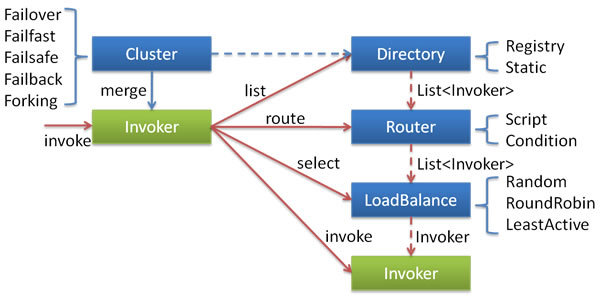
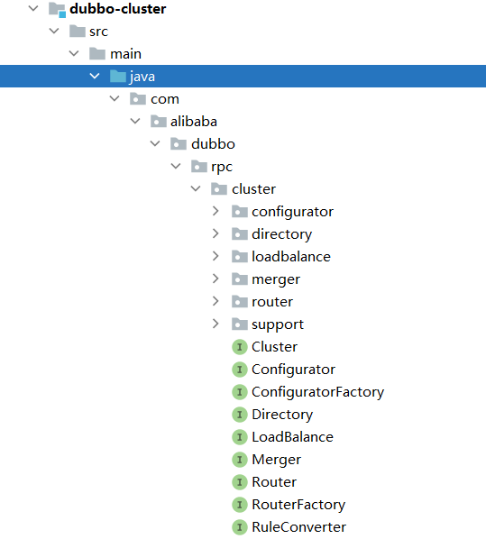
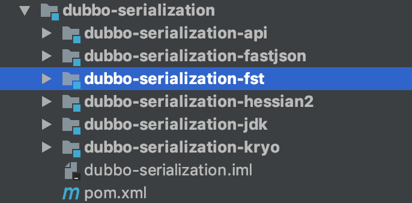
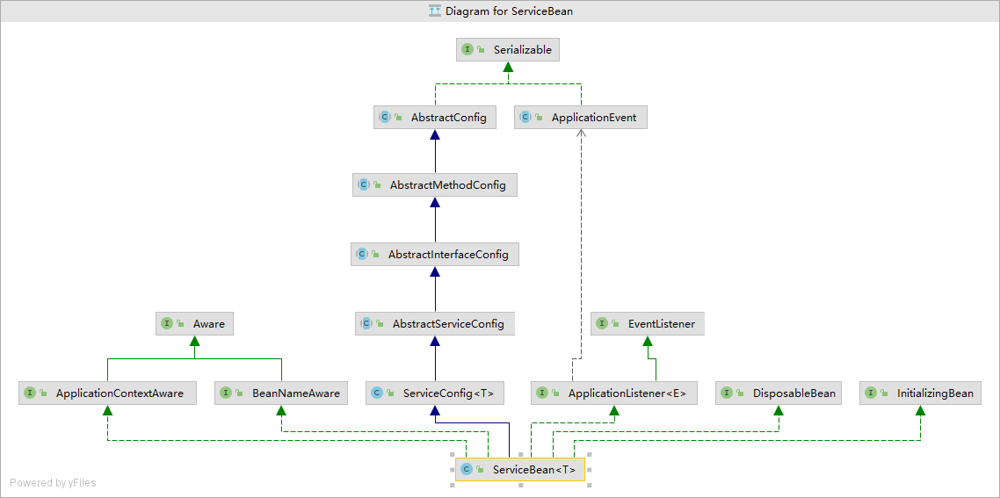

# dubbo源码

​	这里的dubbo源码是基于dubbo2.6.2的，用其他版本可能会有所不同，请注意！尤其dubbo3.0和2.0的差别很大，请注意！特别注意，这里的进入方法就是：ctrl+鼠标左键。

​	源码下载传送门：https://github.com/apache/dubbo/archive/refs/tags/dubbo-2.6.3.zip

## 模块介绍

​	因为模块较多，为了对dubbo有个整体概念，这里先看一眼每个模块的作用再开始深入：

### 注册中心模块(dubbo-registy)

官方文档的解释：基于注册中心下发地址的集群方式，以及对各种注册中心的抽象。

我的理解是：dubbo的注册中心实现有Multicast注册中心、Zookeeper注册中心、Redis注册中心、Simple注册中心（具体怎么实现我在后面文章中会介绍），这个模块就是封装了dubbo所支持的注册中心的实现。

* dubbo-registry-api：抽象了注册中心的注册和发现，实现了一些公用的方法，让子类只关注部分关键方法。
* 以下四个包是分别是四种注册中心实现方法的封装，其中dubbo-registry-default就是官方文档里面的Simple注册中心。


### 集群模块(dubbo-cluster)

​	官方文档的解释：将多个服务提供方伪装为一个提供方，包括：负载均衡, 容错，路由等，集群的地址列表可以是静态配置的，也可以是由注册中心下发。

​	我的理解：它就是一个解决出错情况采用的策略，这个模块里面封装了多种策略的实现方法，并且也支持自己扩展集群容错策略，cluster把多个Invoker伪装成一个Invoker，并且在伪装过程中加入了容错逻辑，失败了，重试下一个。



查看cluster的目录结构：

* configurator包：配置包，dubbo的基本设计原则是采用URL作为配置信息的统一格式，所有拓展点都通过传递URL携带配置信息，这个包就是用来根据统一的配置规则生成配置信息。
* directory包：Directory 代表了多个 Invoker，并且它的值会随着注册中心的服务变更推送而变化 。这里介绍一下Invoker，Invoker是Provider的一个调用Service的抽象，Invoker封装了Provider地址以及Service接口信息。
* loadbalance包：封装了负载均衡的实现，负责利用负载均衡算法从多个Invoker中选出具体的一个Invoker用于此次的调用，如果调用失败，则需要重新选择。
* merger包：封装了合并返回结果，分组聚合到方法，支持多种数据结构类型。
* router包：封装了路由规则的实现，路由规则决定了一次dubbo服务调用的目标服务器，路由规则分两种：条件路由规则和脚本路由规则，并且支持可拓展。
* support包：封装了各类Invoker和cluster，包括集群容错模式和分组聚合的cluster以及相关的Invoker。



### 公共逻辑模块（dubbo-common）

官方文档的解释：包括 Util 类和通用模型。

我的理解：这个应该很通俗易懂，工具类就是一些公用的方法，通用模型就是贯穿整个项目的统一格式的模型，比如URL，上述就提到了URL贯穿了整个项目。

### 配置模块（dubbo-config）

官方文档的解释：是 Dubbo 对外的 API，用户通过 Config 使用Dubbo，隐藏 Dubbo 所有细节。

我的理解：用户都是使用配置来使用dubbo，dubbo也提供了四种配置方式，包括XML配置、属性配置、API配置、注解配置，配置模块就是实现了这四种配置的功能。

* dubbo-config-api：实现了API配置和属性配置的功能。
* dubbo-config-spring：实现了XML配置和注解配置的功能。


	###  远程调用模块（dubbo-rpc）

官方文档的解释：抽象各种协议，以及动态代理，只包含一对一的调用，不关心集群的管理。

我的理解：远程调用，最主要的肯定是协议，dubbo提供了许许多多的协议实现，不过官方推荐时使用dubbo自己的协议。

* dubbo-rpc-api：抽象了动态代理和各类协议，实现一对一的调用
* 另外的包都是各个协议的实现。

### 远程通信模块（dubbo-remoting）

官方文档的解释：相当于 Dubbo 协议的实现，如果 RPC 用 RMI协议则不需要使用此包。

我的理解：提供了多种客户端和服务端通信功能，比如基于Grizzly、Netty、Tomcat等等，RPC用除了RMI的协议都要用到此模块。

* dubbo-remoting-api：定义了客户端和服务端的接口。
* dubbo-remoting-grizzly：基于Grizzly实现的Client和Server。
* dubbo-remoting-http：基于Jetty或Tomcat实现的Client和Server。
* dubbo-remoting-mina：基于Mina实现的Client和Server。
* dubbo-remoting-netty：基于Netty3实现的Client和Server。
* Dubbo-remoting-netty4：基于Netty4实现的Client和Server。
* dubbo-remoting-p2p：P2P服务器，注册中心multicast中会用到这个服务器使用。
* dubbo-remoting-zookeeper：封装了Zookeeper Client ，和 Zookeeper Server 通信。


### 容器模块（dubbo-container）

​	官方文档的解释：是一个 Standlone 的容器，以简单的 Main 加载 Spring 启动，因为服务通常不需要 Tomcat/JBoss 等 Web 容器的特性，没必要用 Web 容器去加载服务。

​	我的理解：因为后台服务不需要Tomcat/JBoss 等 Web 容器的功能，不需要用这些厚实的容器去加载服务提供方，既资源浪费，又增加复杂度。服务容器只是一个简单的Main方法，加载一些内置的容器，也支持扩展容器。

* dubbo-container-api：定义了Container接口，实现了服务加载的Main方法。
* 其他三个分别提供了对应的容器，供Main方法加载。


### 监控模块(dubbo-monitor)

官方文档的解释：统计服务调用次数，调用时间的，调用链跟踪的服务。

我的理解：这个模块很清楚，就是对服务的监控。

* dubbo-monitor-api：定义了monitor相关的接口，实现了监控所需要的过滤器。
* dubbo-monitor-default：实现了dubbo监控相关的功能。


### 清理模块(dubbo-bootstrap)

​	这个模块只有一个类，是作为dubbo的引导类，并且在停止期间进行清理资源。具体的介绍我在后续文章中讲解。

### 示例模块(dubbo-demo)

​	这个模块是快速启动示例，其中包含了服务提供方和调用方，注册中心用的是multicast，用XML配置方法，后续我们介绍源码将从这个模块起来举例。

### 过滤器模块(dubbo-filter)

​	这个模块提供了内置的一些过滤器：

* dubbo-filter-cache：提供缓存过滤器。
* dubbo-filter-validation：提供参数验证过滤器。


### 插件模块(dubbo-plugin)

​	提供了内置的插件：

* dubbo-qos：提供了在线运维的命令。


### 序列化模块

​	该模块中封装了各类序列化框架的支持实现：

* dubbo-serialization-api：定义了Serialization的接口以及数据输入输出的接口。
* 其他的包都是实现了对应的序列化框架的方法。dubbo内置的就是这几类的序列化框架，序列化也支持扩展。



### 测试模块(dubbo-test)

这个模块封装了针对dubbo的性能测试、兼容性测试等功能。

* dubbo-test-benchmark：对性能的测试。
* dubbo-test-compatibility：对兼容性的测试，对spring3对兼容性测试。
* dubbo-test-examples：测试所使用的示例。
* dubbo-test-integration：测试所需的pom文件


## dubbo源码解析（一）

### 标签解析和bean的初始化

* 首先找到程序入口，在dubbo-demo下的dubbo-demo-consumer中的consumer文件中：


​	进入查看代码发现依赖了一个配置类，META-INF/spring/dubbo-demo-consumer.xml。

```java
    public static void main(String[] args) {
        //Prevent to get IPV6 address,this way only work in debug mode
        //But you can pass use -Djava.net.preferIPv4Stack=true,then it work well whether in debug mode or not
        System.setProperty("java.net.preferIPv4Stack", "true");
        ClassPathXmlApplicationContext context = new ClassPathXmlApplicationContext(new String[]{"META-INF/spring/dubbo-demo-consumer.xml"});
        context.start();
        DemoService demoService = (DemoService) context.getBean("demoService"); // get remote service proxy

        while (true) {
            try {
                Thread.sleep(1000);
                String hello = demoService.sayHello("world"); // call remote method
                System.out.println(hello); // get result

            } catch (Throwable throwable) {
                throwable.printStackTrace();
            }
        }
    }
```

* 追踪META-INF/spring/dubbo-demo-consumer.xml这个配置类，我们发现它引用的xsd文件包括spring的**spring-beans-4.3.xsd文件和dubbo.xsd，dubbo.xsd文件定义了xml文件的解析规则**。 例如看dubbo: reference，在xsd文件中可以看到reference对应的配置，对应ReferenceConfig类。**所以我们现在要追踪的是：
  * dubbo.xsd

```xml
<beans xmlns:xsi="http://www.w3.org/2001/XMLSchema-instance"
       xmlns:dubbo="http://dubbo.apache.org/schema/dubbo"
       xmlns="http://www.springframework.org/schema/beans"
       xsi:schemaLocation="http://www.springframework.org/schema/beans http://www.springframework.org/schema/beans/spring-beans-4.3.xsd
       http://dubbo.apache.org/schema/dubbo http://dubbo.apache.org/schema/dubbo/dubbo.xsd">

    <!-- consumer's application name, used for tracing dependency relationship (not a matching criterion),
    don't set it same as provider -->
    <dubbo:application name="dub-consumer"/>

    <!-- use multicast registry center to discover service -->
    <dubbo:registry address="multicast://224.5.6.7:1234"/>

    <!-- generate proxy for the remote service, then demoService can be used in the same way as the
    local regular interface -->
    <dubbo:reference id="demoService" check="false" interface="com.alibaba.dubbo.demo.DemoService"/>
</beans>
```

* ctrl+鼠标左键进入到dubbo.xsd，这里主要查看

  * service
  * reference

  注：这里的\<xsd:annotation>使用DubboBeanDefinitionParser方法转译成的bean，所以看不懂，往下看即可。

```xml
    <xsd:element name="service" type="serviceType">
        <xsd:annotation>
            <xsd:documentation><![CDATA[ Export service config ]]></xsd:documentation>
        </xsd:annotation>
    </xsd:element>

    <xsd:element name="reference" type="referenceType">
        <xsd:annotation>
            <xsd:documentation><![CDATA[ Reference service config ]]></xsd:documentation>
        </xsd:annotation>
    </xsd:element>
```

* 找到dubbo.xsd的上级目录下的spring.handles：
  * 因为handles这里配置了DubboNamespaceHandler，进入这个类查看：可以发现这个类使用了DubboBeanDefinitionParser帮我们解析上面的标签,并且自定义了ServiceBean和ReferenceBean。

```properties
http\://dubbo.apache.org/schema/dubbo=com.alibaba.dubbo.config.spring.schema.DubboNamespaceHandler
http\://code.alibabatech.com/schema/dubbo=com.alibaba.dubbo.config.spring.schema.DubboNamespaceHandler	
```

内部机制都是依托于<dubbo:annotation />标签。 通过源码分析，Dubbo对于Spring xml解析处理由      com.alibaba.dubbo.config.spring.schema.DubboNamespaceHandler提供：DubboNamespaceHandler.java

```java
public class DubboNamespaceHandler extends NamespaceHandlerSupport {

    static {
        Version.checkDuplicate(DubboNamespaceHandler.class);
    }	
    @Override
    public void init() {
        registerBeanDefinitionParser("application", new DubboBeanDefinitionParser(ApplicationConfig.class, true));
        registerBeanDefinitionParser("module", new DubboBeanDefinitionParser(ModuleConfig.class, true));
        registerBeanDefinitionParser("registry", new DubboBeanDefinitionParser(RegistryConfig.class, true));
        registerBeanDefinitionParser("monitor", new DubboBeanDefinitionParser(MonitorConfig.class, true));
        registerBeanDefinitionParser("provider", new DubboBeanDefinitionParser(ProviderConfig.class, true));
        registerBeanDefinitionParser("consumer", new DubboBeanDefinitionParser(ConsumerConfig.class, true));
        registerBeanDefinitionParser("protocol", new DubboBeanDefinitionParser(ProtocolConfig.class, true));
        registerBeanDefinitionParser("service", new DubboBeanDefinitionParser(ServiceBean.class, true));
        registerBeanDefinitionParser("reference", new DubboBeanDefinitionParser(ReferenceBean.class, false));
        registerBeanDefinitionParser("annotation", new AnnotationBeanDefinitionParser());
    }
}
```

* 这里不急着看DubboBeanDefinitionParser，我们先来看一下registerBeanDefinitionParser这个类所需的元素，可以得到两个信息
  * elementName：传入元素名
  * BeanDefinitionParser：传入解析后的bean

  从这里我们可以看出DubboBeanDefinitionParser最终是返回了一个BeanDefinitionParser的类或者子类出来：

```java
    protected final void registerBeanDefinitionParser(String elementName, BeanDefinitionParser parser) {
        this.parsers.put(elementName, parser);
    }
```

* 点击进入DubboBeanDefinitionParser，可以发现：
  * DubboBeanDefinitionParser是一个构造函数，会根据传入的beanclass和required
    * beanclass：要被解析成的配置类（或者叫做，空的实体类）
    * required：是否进行解析
  * pares方法调用了内部方法parse，介绍一下传入参数：
    * element：表示 HTML 或 XML 文档中的元素。 元素可能有与之关联的属性
    * beanclass：要被解析成的配置类（或者叫做，空的实体类）
    * required：是否进行解析

```java
    public DubboBeanDefinitionParser(Class<?> beanClass, boolean required) {
        this.beanClass = beanClass;
        this.required = required;
    }
    public BeanDefinition parse(Element element, ParserContext parserContext) {
        return parse(element, parserContext, beanClass, required);
    }
```

* 下面跟进parse方法，查看发生了什么：
  * 解释一下传入参数
    * element：表示 HTML 或 XML 文档中的元素。 元素可能有与之关联的属性
    * parserContext：解析外部命名空间的bean，所需要用到的类。
    * beanClass：要被解析成的配置类（或者叫做，空的实体类）
    * required：如果id为空，则进行解析，解析成xml里的name、interface、或者bean的名字

```java
    @SuppressWarnings("unchecked")
    private static BeanDefinition parse(Element element, ParserContext parserContext, Class<?> beanClass, boolean required) {
        //创建一个RootBeanDefinition,作为要返回的类
        RootBeanDefinition beanDefinition = new RootBeanDefinition();
        //把我们需要注入的beanclass放入
        beanDefinition.setBeanClass(beanClass);
        //不设置懒加载
        beanDefinition.setLazyInit(false);
        //从xml里面获取id
        String id = element.getAttribute("id");//(*)
        //未获取到id或id为空，且是否需要解析为需要
        if ((id == null || id.length() == 0) && required) {
            //进行id的解析，根据结点属性解析成xml的标签属性或处理结点名#
            //从xml里获取bean的name
            String generatedBeanName = element.getAttribute("name");
            if (generatedBeanName == null || generatedBeanName.length() == 0) {
                //若为protocol处理结点，且name为空，则默认为  "dubbo"
                if (ProtocolConfig.class.equals(beanClass)) {
                    generatedBeanName = "dubbo";
                } else {
                //如果是普通结点则为其配置成interface的值
                    generatedBeanName = element.getAttribute("interface");
                }
            }
            if (generatedBeanName == null || generatedBeanName.length() == 0) {
                //如果id不为空，但generatedBeanName为空，则设置成对应的class名字
                generatedBeanName = beanClass.getName();
            }
            id = generatedBeanName;//将id改为置入的bean名(*)
            int counter = 2; //初始化counter为2
            while (parserContext.getRegistry().containsBeanDefinition(id)) {
                //为防止出现id重复，从parserContext中获取bean
                // 判断是否重复，重复则将generatedBeanName和counter进行拼串
                //重复则进行循环拼串，拼到不重复为止
                id = generatedBeanName + (counter++);//进行一个拼串(*)
            }
        }
        if (id != null && id.length() > 0) {//将id写入容器中
            //由于传入的required为true，所以这个位置必定会进入#
            //判断传入的id是否包含在parserContext中
            //包含则抛出异常
            if (parserContext.getRegistry().containsBeanDefinition(id)) {
                throw new IllegalStateException("Duplicate spring bean id " + id);
            }
            //注册id-beandefinetion到容器中
            parserContext.getRegistry().registerBeanDefinition(id, beanDefinition);
            //向我们要返回的beanDefinition传入id,前面一切的目的都是为了这一步，向里面放入id(*)
            beanDefinition.getPropertyValues().addPropertyValue("id", id);
        }
        // <dubbo:protocol/>标签处理
        if (ProtocolConfig.class.equals(beanClass)) { //如果是为protocol处理结点
            for (String name : parserContext.getRegistry().getBeanDefinitionNames()) {//迭代获取bean的名字
                BeanDefinition definition = parserContext.getRegistry().getBeanDefinition(name);//从拿到的名字里获取bean
                PropertyValue property = definition.getPropertyValues().getPropertyValue("protocol");//获取protocol处理结点
                if (property != null) {//如果结点不为空
                    Object value = property.getValue();//从处理结点中获取对象
                    if (value instanceof ProtocolConfig && id.equals(((ProtocolConfig) value).getName())) {
                        //如果value是ProtocolConfig的实体类或者子类，并且id的值和ProtocolConfig的妹子相同
                        //获取知识点：instanceof，表示左边的是否为右边的实体类或子类
                        //则为其添加对当前bean id的依赖
                        definition.getPropertyValues().addPropertyValue("protocol", new RuntimeBeanReference(id));
                    }
                }
            }
            // <dubbo:service/>标签
        } else if (ServiceBean.class.equals(beanClass)) {//如果是service
            //从标签中获取bean
            String className = element.getAttribute("class");
            //如果存在这个bean
            if (className != null && className.length() > 0) {
                // 构建配置的class的BeanDefinition
                RootBeanDefinition classDefinition = new RootBeanDefinition();
                // 设置beanClass
                classDefinition.setBeanClass(ReflectUtils.forName(className));
                //不设置懒加载
                classDefinition.setLazyInit(false);
                //解析<property/>子标签
                parseProperties(element.getChildNodes(), classDefinition);
                //添加ServiceBean ref属性的依赖
                beanDefinition.getPropertyValues().addPropertyValue("ref", new BeanDefinitionHolder(classDefinition, id + "Impl"));
            }
            // <dubbo:provider/>标签
        } else if (ProviderConfig.class.equals(beanClass)) {
            //解析嵌套元素,parseNested方法后面会讲。
            parseNested(element, parserContext, ServiceBean.class, true, "service", "provider", id, beanDefinition);
            // <dubbo:consumer/>标签
        } else if (ConsumerConfig.class.equals(beanClass)) {
            //解析嵌套元素
            parseNested(element, parserContext, ReferenceBean.class, false, "reference", "consumer", id, beanDefinition);
        }
        Set<String> props = new HashSet<String>();//初始化一个hashset名为props
        ManagedMap parameters = null;//初始化一个Managedmap
        for (Method setter : beanClass.getMethods()) {//遍历beanclass的方法
            String name = setter.getName();//获取方法名
            //判断是否是public的有参数的setter方法
            if (name.length() > 3 && name.startsWith("set")
                    && Modifier.isPublic(setter.getModifiers())
                    && setter.getParameterTypes().length == 1) {
                //获取参数类型
                Class<?> type = setter.getParameterTypes()[0];
                // 将驼峰命名去除改成由-连接，如setApplicationContext --> application-context
                String property = StringUtils.camelToSplitName(name.substring(3, 4).toLowerCase() + name.substring(4), "-");
                //加入我们定义的hashset中
                props.add(property);

                Method getter = null;//初始化一个方法命名为getter方法
                try {
                    //获取以get开头的方法
                    getter = beanClass.getMethod("get" + name.substring(3), new Class<?>[0]);
                } catch (NoSuchMethodException e) { //捕获没有这个方法的异常
                    try {
                        //获取以is开头的方法
                        getter = beanClass.getMethod("is" + name.substring(3), new Class<?>[0]);
                    } catch (NoSuchMethodException e2) {//捕获没有这个方法的异常
                    }
                }
                //如果获取方法为空，或者方法不为公共，又或者setter方法的类型和getter方法返回类型不同，则退出循环
                // 注:type是setter方法的传入参数类型
                if (getter == null
                        || !Modifier.isPublic(getter.getModifiers())
                        || !type.equals(getter.getReturnType())) {
                    continue;
                }
                if ("parameters".equals(property)) {
                    /* parameters属性解析 */
                    parameters = parseParameters(element.getChildNodes(), beanDefinition);
                } else if ("methods".equals(property)) {
                    /* methods属性解析 */
                    parseMethods(id, element.getChildNodes(), beanDefinition, parserContext);
                } else if ("arguments".equals(property)) {
                    /* arguments属性解析 */
                    parseArguments(id, element.getChildNodes(), beanDefinition, parserContext);
                } else {
                    //如果都不是，则从标签里获取标签名为property的值
                    String value = element.getAttribute(property);
                    if (value != null) {
                    //值不为空，则去除值的头部和尾部的空字符
                        value = value.trim();
                        if (value.length() > 0) { //如果字符长度大于1
                            //如果property的值是registry，并且忽略大小写它的值是为N/A
                            if ("registry".equals(property) && RegistryConfig.NO_AVAILABLE.equalsIgnoreCase(value)) {
                                RegistryConfig registryConfig = new RegistryConfig();
                                //创建registryConfig，将其地址设置为N/A
                                registryConfig.setAddress(RegistryConfig.NO_AVAILABLE);
                                //将registryConfig设置进要返回的beanDefinition中
                                beanDefinition.getPropertyValues().addPropertyValue(property, registryConfig);
                                //如果property不为registry，且不含有','
                            } else if ("registry".equals(property) && value.indexOf(',') != -1) {
                                //遍历设置成registries，也可以跟进查看一下parseMultiRef方法
                                parseMultiRef("registries", value, beanDefinition, parserContext);
                            } else if ("provider".equals(property) && value.indexOf(',') != -1) {
                                //遍历设置成providers
                                parseMultiRef("providers", value, beanDefinition, parserContext);
                            } else if ("protocol".equals(property) && value.indexOf(',') != -1) {
                                //遍历设置成protocols
                                parseMultiRef("protocols", value, beanDefinition, parserContext);
                            } else {
                                Object reference;
                                //判断是否为基本数据类型和包装类型，类似Long，String，Short等
                                //以下的代码全部都是为了版本兼容，看到这里就差不多了，当然也可以继续看
                                if (isPrimitive(type)) {
                                    // 向后兼容旧版本的xsd中的默认值，因为每个版本的xsd都配有默认值，例如
                                    // <xsd:attribute name="version" type="xsd:string" use="optional" default="0.0.0">
                                    if ("async".equals(property) && "false".equals(value)
                                            || "timeout".equals(property) && "0".equals(value)
                                            || "delay".equals(property) && "0".equals(value)
                                            || "version".equals(property) && "0.0.0".equals(value)
                                            || "stat".equals(property) && "-1".equals(value)
                                            || "reliable".equals(property) && "false".equals(value)) {
                                        // backward compatibility for the default value in old version's xsd
                                        value = null;
                                    }
                                    reference = value;
                                } else if ("protocol".equals(property)
                                        //如果属性为 protocol 那么要判断protocol对应的拓展点配置有没有
                                        && ExtensionLoader.getExtensionLoader(Protocol.class).hasExtension(value)
                                        //满足当前值没有在容器内 或者 在容器内类的名字不同
                                        && (!parserContext.getRegistry().containsBeanDefinition(value)
                                        || !ProtocolConfig.class.getName().equals(parserContext.getRegistry().getBeanDefinition(value).getBeanClassName()))) {
                                    if ("dubbo:provider".equals(element.getTagName())) {
                                        //标签的值如果等于dubbo:provider，则输出警告
                                        logger.warn("Recommended replace <dubbo:provider protocol=\"" + value + "\" ... /> to <dubbo:protocol name=\"" + value + "\" ... />");
                                    }

                                    ProtocolConfig protocol = new ProtocolConfig();
                                    protocol.setName(value);
                                    // 兼容旧版本配置
                                    reference = protocol;
                                } else if ("onreturn".equals(property)) {
                                    //回调方法 类似onSuccess
                                    int index = value.lastIndexOf(".");
                                    // bean的名字
                                    String returnRef = value.substring(0, index);
                                    String returnMethod = value.substring(index + 1);
                                    reference = new RuntimeBeanReference(returnRef);
                                    // 添加onreturnMethod属性值
                                    beanDefinition.getPropertyValues().addPropertyValue("onreturnMethod", returnMethod);
                                } else if ("onthrow".equals(property)) {
                                    //回调 异常执行的方法 ,类似 onError
                                    int index = value.lastIndexOf(".");
                                    String throwRef = value.substring(0, index);
                                    String throwMethod = value.substring(index + 1);
                                    //获取ref和方法，将ref放入RuntimeBeanReference中
                                    reference = new RuntimeBeanReference(throwRef);
                                    //向我们自定义类里添加onthrowMethod的值
                                    beanDefinition.getPropertyValues().addPropertyValue("onthrowMethod", throwMethod);
                                } else if ("oninvoke".equals(property)) {
                                    int index = value.lastIndexOf(".");
                                    String invokeRef = value.substring(0, index);
                                    String invokeRefMethod = value.substring(index + 1);
                                    //获取ref和方法，将ref放入RuntimeBeanReference中
                                    reference = new RuntimeBeanReference(invokeRef);
                                    //向我们自定义类里添加oninvokeMethod的值
                                    beanDefinition.getPropertyValues().addPropertyValue("oninvokeMethod", invokeRefMethod);
                                }else {
                                    //如果以上都没进行操作，并且property的字符等于ref，容器包含它的值，
                                    if ("ref".equals(property) && parserContext.getRegistry().containsBeanDefinition(value)) {
                                        //从ref里面获取这个bean
                                        BeanDefinition refBean = parserContext.getRegistry().getBeanDefinition(value);
                                        /*
                                            必须是单例bean(singleton),原型bean（prototype）不行,sevice初始化一次,在spring容器里也只有一个 实例
                                            是不是和dubbo的幂等有关，如果为原型bean，那么服务就变成有状态的了
                                         */
                                        if (!refBean.isSingleton()) {//如果不是单例的bean
                                            throw new IllegalStateException("The exported service ref " + value + " must be singleton! Please set the " + value + " bean scope to singleton, eg: <bean id=\"" + value + "\" scope=\"singleton\" ...>");
                                        }
                                    }
                                    reference = new RuntimeBeanReference(value);
                                }
                                 /*
                                    设置属性，值为另外一个关联的bean
                                    RuntimeBeanReference 固定占位符类，当在beanfactory中作为另外一个bean的引用时，作为属性值对象，将在运行时进行解析
                                 */
                                beanDefinition.getPropertyValues().addPropertyValue(property, reference);
                            }
                        }
                    }
                }
            }
        }
        NamedNodeMap attributes = element.getAttributes();
        //获取解析完后的下一个元素，就是还没被解析的元素
        //没见过这样的map，试了一下里面存储类Node，Node是一个包含很多信息的结点。
        int len = attributes.getLength();
        //遍历获取attributes
        for (int i = 0; i < len; i++) {
            //获取第i个索引对应节点
            Node node = attributes.item(i);
            //获取此结点的名字
            String name = node.getLocalName();
            if (!props.contains(name)) {//查看props否包含name
                if (parameters == null) {//如果parameters为空，则给与新的ManagedMap
                    parameters = new ManagedMap();
                }
                String value = node.getNodeValue();//获取node的值
                //向parameters放入结点名字，将value转成String类型
                parameters.put(name, new TypedStringValue(value, String.class));
            }
        }
        //如果parameters不为空
        if (parameters != null) {
            //将获取到的元素全部添加进自定义的bean中
            beanDefinition.getPropertyValues().addPropertyValue("parameters", parameters);
        }
        //返回自定义的bean
        return beanDefinition;
    }

```

* 下面讲一下parse里面用到的方法，一些简单的就略过了：

```java
    private static void parseNested(Element element, ParserContext parserContext, Class<?> beanClass, boolean required, String tag, String property, String ref, BeanDefinition beanDefinition) {
        //获取标签的子节点
        NodeList nodeList = element.getChildNodes();
        //链表结点不为空
        if (nodeList != null && nodeList.getLength() > 0) {
            //初始化first为真
            boolean first = true;
            for (int i = 0; i < nodeList.getLength(); i++) {
                //传入索引i获取对应的结点node
                Node node = nodeList.item(i);
                //如果node和Element同类型或子类
                if (node instanceof Element) {
                     //传入的标签名和结点名相同 或者 和类名相同
                    if (tag.equals(node.getNodeName())
                            || tag.equals(node.getLocalName())) {
                        if (first) {
                            //把first设置为false
                            first = false;
                            String isDefault = element.getAttribute("default");
                            // 如果第一个子节点default属性为null，则设置为false
                            if (isDefault == null || isDefault.length() == 0) {
                                beanDefinition.getPropertyValues().addPropertyValue("default", "false");
                            }
                        }
                        // 递归解析嵌套的子节点
                        BeanDefinition subDefinition = parse((Element) node, parserContext, beanClass, required);
                        if (subDefinition != null && ref != null && ref.length() > 0) {
                            subDefinition.getPropertyValues().addPropertyValue(property, new RuntimeBeanReference(ref));
                        }
                    }
                }
            }
        }
    }
//遍历nodeList，解析出对应的方法，放入我们自定义的bean里
    @SuppressWarnings("unchecked")
    private static void parseMethods(String id, NodeList nodeList, RootBeanDefinition beanDefinition,
                                     ParserContext parserContext)
        
// 遍历元素，将元素存入map中，返回这个map
    @SuppressWarnings("unchecked")
    private static ManagedMap parseParameters(NodeList nodeList, RootBeanDefinition beanDefinition)
```

### Bean的初始化

​	这里我们通过ServiceBean来分析一下bean的初始化过程。由上文可知，service标签解析出来的BeanDefinition时单例非懒加载的，该BeanDefinition会在容器启动时直接初始化，下面我们来分析一下ServiceBean这个Bean的初始化过程。

* 先找到dubbo-config-spring下的ServiceBean，这里包含6个主要的方法，这些方法来自于它实现的接口，我们这里提一嘴这些接口。
   * InitializingBean 		--afterPropertiesSet方法  spring会在对象实例化之后调用该方法  一般用于初始化一些属性
   * DisposableBean  		--destroy方法，spring容器关闭时调用，在销毁单例时由 BeanFactory 调用。
   * ApplicationContextAware	--setApplicationContext方法  会传入一个ApplicationContext的实例。如果对象需要访问文件资源，即想要调用getResource ，想要发布应用程序事件，或者需要访问 MessageSource，也可以实现此接口。

   * ApplicationListener		--onApplicationEvent方法 添加了上下文刷新的一个监听事件
   * BeanNameAware			--setBeanName方法  设置BeanName，在创建此 bean 的 bean 工厂中设置 bean 的名称。

```java
public class ServiceBean<T> extends ServiceConfig<T> implements InitializingBean, DisposableBean, ApplicationContextAware, ApplicationListener<ContextRefreshedEvent>, BeanNameAware {
...实现了6个主要方法
}
```

继承关系如下图所示：



 其中实现的接口有几个涉及到spring Bean的生命周期接口，这里我们分析一下具体的方法内容。

（查看一个关系图的具体接口，右键点击这个接口，然后jump to source即可）

#### Aware接口实现

* BeanNameAware的setBeanName方法实现：
  * 接口介绍：由想要在 bean 工厂中知道其 bean 名称的 bean 实现的接口。 请注意，通常不建议对象依赖于它的 bean 名称，因为这表示对外部配置的潜在脆弱依赖，以及对 Spring API 的可能不必要的依赖。

```java
//由想要在 bean 工厂中知道其 bean 名称的 bean 实现的接口。
//请注意，通常不建议对象依赖于它的 bean 名称，因为这表示对外部配置的潜在脆弱依赖，以及对 Spring API 的可能不必要的依赖
    @Override
    public void setBeanName(String name) {
        this.beanName = name;
    }
```

* ApplicationContextAware的setApplicationContext方法实现：
  * SpringExtensionFactory的作用在于dubbo的SPI机制中的依赖注入，当有扩展类需要注入其他bean的时候，可能会从SpringExtensionFactory这个类中通过applicationContext获取Bean对象。

```java
//当一个对象需要访问一组协作 bean 时，实现这个接口是有意义的。 请注意，通过 bean 引用进行配置比仅出于 bean 查找目的实现此接口更可取。
//如果对象需要访问文件资源，即想要调用getResource ，想要发布应用程序事件，或者需要访问 MessageSource，也可以实现此接口
    @Override
    public void setApplicationContext(ApplicationContext applicationContext) {
        this.applicationContext = applicationContext;
        //将applicationContext设置到SpringExtensionFactory中,用于后续从SpringExtensionFactory中获取Bean
        //SpringExtensionFactory是dubbo自定义的一个类
        SpringExtensionFactory.addApplicationContext(applicationContext);
        if (applicationContext != null) {
            SPRING_CONTEXT = applicationContext;
            try {
                Method method = applicationContext.getClass().getMethod("addApplicationListener", new Class<?>[]{ApplicationListener.class}); // backward compatibility to spring 2.0.1
                method.invoke(applicationContext, new Object[]{this});
                supportedApplicationListener = true;
            } catch (Throwable t) {
                if (applicationContext instanceof AbstractApplicationContext) {
                    try {
                        Method method = AbstractApplicationContext.class.getDeclaredMethod("addListener", new Class<?>[]{ApplicationListener.class}); // backward compatibility to spring 2.0.1
                        if (!method.isAccessible()) {
                            method.setAccessible(true);
                        }
                        method.invoke(applicationContext, new Object[]{this});
                        supportedApplicationListener = true;
                    } catch (Throwable t2) {
                    }
                }
            }
        }
    }
```

* InitializingBean的afterPropertiesSet方法实现：
  * 接口介绍：例如，当一个对象需要访问一组协作 bean 时，实现这个接口是有意义的。 请注意，通过 bean 引用进行配置比仅出于 bean 查找目的实现此接口更可取。
    如果对象需要访问文件资源，即想要调用getResource ，想要发布应用程序事件，或者需要访问 MessageSource，也可以实现此接口。

```java
    @Override
    @SuppressWarnings({ "deprecation"})
    public void afterPropertiesSet() throws Exception {
    	//如果当前ServiceBan的provider为空
    	if (getProvider() == null) {
            Map<String, ProviderConfig> providerConfigMap = applicationContext == null ? null : BeanFactoryUtils.beansOfTypeIncludingAncestors(applicationContext, ProviderConfig.class, false, false);
            if (providerConfigMap != null && providerConfigMap.size() > 0) {
                Map<String, ProtocolConfig> protocolConfigMap = applicationContext == null ? null : BeanFactoryUtils.beansOfTypeIncludingAncestors(applicationContext, ProtocolConfig.class, false, false);
                if ((protocolConfigMap == null || protocolConfigMap.size() == 0)
                        && providerConfigMap.size() > 1) { // backward compatibility
                    List<ProviderConfig> providerConfigs = new ArrayList<ProviderConfig>();
                    for (ProviderConfig config : providerConfigMap.values()) {
                        if (config.isDefault() != null && config.isDefault().booleanValue()) {
                            providerConfigs.add(config);
                        }
                    }
                    if (!providerConfigs.isEmpty()) {
                        setProviders(providerConfigs);
                    }
                } else {
                    ProviderConfig providerConfig = null;
                    for (ProviderConfig config : providerConfigMap.values()) {
                        if (config.isDefault() == null || config.isDefault().booleanValue()) {
                            if (providerConfig != null) {
                                throw new IllegalStateException("Duplicate provider configs: " + providerConfig + " and " + config);
                            }
                            providerConfig = config;
                        }
                    }
                    if (providerConfig != null) {
                        setProvider(providerConfig);
                    }
                }
            }
        }
        
        //如果当前ServiceBan的application为空，则为该Service设置application
        if (getApplication() == null
                && (getProvider() == null || getProvider().getApplication() == null)) {
            Map<String, ApplicationConfig> applicationConfigMap = applicationContext == null ? null : BeanFactoryUtils.beansOfTypeIncludingAncestors(applicationContext, ApplicationConfig.class, false, false);
            if (applicationConfigMap != null && applicationConfigMap.size() > 0) {
                ApplicationConfig applicationConfig = null;
                for (ApplicationConfig config : applicationConfigMap.values()) {
                    if (config.isDefault() == null || config.isDefault().booleanValue()) {
                        if (applicationConfig != null) {
                            throw new IllegalStateException("Duplicate application configs: " + applicationConfig + " and " + config);
                        }
                        applicationConfig = config;
                    }
                }
                if (applicationConfig != null) {
                    setApplication(applicationConfig);
                }
            }
        }
        //如果当前ServiceBan的module为空，则为该Service设置module
        if (getModule() == null
                && (getProvider() == null || getProvider().getModule() == null)) {
            Map<String, ModuleConfig> moduleConfigMap = applicationContext == null ? null : BeanFactoryUtils.beansOfTypeIncludingAncestors(applicationContext, ModuleConfig.class, false, false);
            if (moduleConfigMap != null && moduleConfigMap.size() > 0) {
                ModuleConfig moduleConfig = null;
                for (ModuleConfig config : moduleConfigMap.values()) {
                    if (config.isDefault() == null || config.isDefault().booleanValue()) {
                        if (moduleConfig != null) {
                            throw new IllegalStateException("Duplicate module configs: " + moduleConfig + " and " + config);
                        }
                        moduleConfig = config;
                    }
                }
                if (moduleConfig != null) {
                    setModule(moduleConfig);
                }
            }
        }
        //如果当前ServiceBan的Registries为空，则为该Service设置Registries
        if ((getRegistries() == null || getRegistries().isEmpty())
                && (getProvider() == null || getProvider().getRegistries() == null || getProvider().getRegistries().isEmpty())
                && (getApplication() == null || getApplication().getRegistries() == null || getApplication().getRegistries().isEmpty())) {
            Map<String, RegistryConfig> registryConfigMap = applicationContext == null ? null : BeanFactoryUtils.beansOfTypeIncludingAncestors(applicationContext, RegistryConfig.class, false, false);
            if (registryConfigMap != null && registryConfigMap.size() > 0) {
                List<RegistryConfig> registryConfigs = new ArrayList<RegistryConfig>();
                for (RegistryConfig config : registryConfigMap.values()) {
                    if (config.isDefault() == null || config.isDefault().booleanValue()) {
                        registryConfigs.add(config);
                    }
                }
                if (registryConfigs != null && !registryConfigs.isEmpty()) {
                    super.setRegistries(registryConfigs);
                }
            }
        }
        //如果当前ServiceBan的Monitor为空，则为该Service设置Monitor
        if (getMonitor() == null
                && (getProvider() == null || getProvider().getMonitor() == null)
                && (getApplication() == null || getApplication().getMonitor() == null)) {
            Map<String, MonitorConfig> monitorConfigMap = applicationContext == null ? null : BeanFactoryUtils.beansOfTypeIncludingAncestors(applicationContext, MonitorConfig.class, false, false);
            if (monitorConfigMap != null && monitorConfigMap.size() > 0) {
                MonitorConfig monitorConfig = null;
                for (MonitorConfig config : monitorConfigMap.values()) {
                    if (config.isDefault() == null || config.isDefault().booleanValue()) {
                        if (monitorConfig != null) {
                            throw new IllegalStateException("Duplicate monitor configs: " + monitorConfig + " and " + config);
                        }
                        monitorConfig = config;
                    }
                }
                if (monitorConfig != null) {
                    setMonitor(monitorConfig);
                }
            }
        }
        //如果当前ServiceBan的Protocol为空，则为该Service设置Protocol
        if ((getProtocols() == null || getProtocols().isEmpty())
                && (getProvider() == null || getProvider().getProtocols() == null || getProvider().getProtocols().isEmpty())) {
            Map<String, ProtocolConfig> protocolConfigMap = applicationContext == null ? null : BeanFactoryUtils.beansOfTypeIncludingAncestors(applicationContext, ProtocolConfig.class, false, false);
            if (protocolConfigMap != null && protocolConfigMap.size() > 0) {
                List<ProtocolConfig> protocolConfigs = new ArrayList<ProtocolConfig>();
                for (ProtocolConfig config : protocolConfigMap.values()) {
                    if (config.isDefault() == null || config.isDefault().booleanValue()) {
                        protocolConfigs.add(config);
                    }
                }
                if (protocolConfigs != null && !protocolConfigs.isEmpty()) {
                    super.setProtocols(protocolConfigs);
                }
            }
        }
        // 设置服务名称
        if (getPath() == null || getPath().length() == 0) {
            if (beanName != null && beanName.length() > 0
                    && getInterface() != null && getInterface().length() > 0
                    && beanName.startsWith(getInterface())) {
                setPath(beanName);
            }
        }
        if (!isDelay()) {	//若非延迟加载
            export();	//服务暴露
        }
    }
```

* ApplicationListener的onApplicationEvent方法实现：
  * 接口介绍：应用程序事件侦听器要实现的接口。

```java
    @Override
    public void onApplicationEvent(ContextRefreshedEvent event) {
    	// 服务没有延迟加载 && 服务没有发布 && 服务没有下线过 。 满足这三个条件，则进行服务暴露
        if (isDelay() && !isExported() && !isUnexported()) {
            if (logger.isInfoEnabled()) {
                logger.info("The service ready on spring started. service: " + getInterface());
            }
            export();	//进行服务暴露
        }
    }
 
    private boolean isDelay() {
    	// 获取延迟加载的设置 ， 延迟注册服务时间(毫秒)- ，设为-1时，表示延迟到Spring容器初始化完成时暴露服务
        Integer delay = getDelay();
        ProviderConfig provider = getProvider();
        if (delay == null && provider != null) {
            delay = provider.getDelay();
        }
        // 加入上下文刷新监听，并且没有设置延迟加载，
        return supportedApplicationListener && (delay == null || delay == -1);
    }
```

* DisposableBean的destroy方法:
  * 接口介绍：由想要在销毁时释放资源的 bean 实现的接口。 如果 BeanFactory 处理缓存的单例，它应该调用 destroy 方法。 应用程序上下文应该在关闭时处理其所有单例。

```java
    @Override
    public void destroy() throws Exception {
        // no need to call unexport() here, see
        // org.apache.dubbo.config.spring.extension.SpringExtensionFactory.ShutdownHookListener
    }
```

整个初始化过程：

> InitializingBean（*afterPropertiesSet*进行初始化)
> --->BeanNameAware(*setBeanName*设置 bean 的名称)
> --->ApplicationContextAware（ApplicationContextAware用将用于初始化对象）
> --->ApplicationListener(onApplicationEvent应用程序事件侦听器要实现的接口)
> --->DisposableBean(destroy在销毁单例时由 BeanFactory 调用)

至此，bean的初始化过程就结束了。从上面的代码可以看出，Dubbo服务暴露是在afterPropertiesSet或onApplicationEvent两个方法中完成的，具体实现就是export方法，下面就涉及到《服务暴露》了，我先去学rocket mq了，下次再说。
