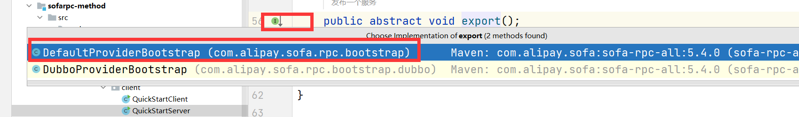
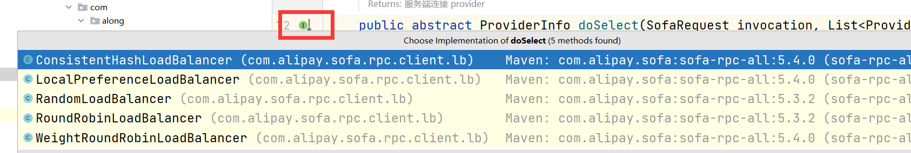

# sofa源码学习

​	要想更好的学习sofa源码，就得对sofa的整个框架体系有一定的了解：


## 服务调用源码

### 例子

​	先举个远程调用的例子，然后再来慢慢说：

* 远程调用要使用的接口

```java
public class HelloSyncServiceImpl implements HelloSyncService {
    @Override
    public String saySync(String msg) {
        System.out.println("Server receive: " + msg);
        return "hello " + msg + " ！";
    }
}
```

* 建立服务端

```java
public class QuickStartServer {
    public static void main(String[] args) {
        ServerConfig serverConfig = new ServerConfig()
                .setProtocol("bolt") // 设置一个协议，默认bolt
                .setPort(12200) // 设置一个端口，默认12200
                .setDaemon(false); // 非守护线程

        ProviderConfig<HelloSyncService> providerConfig = new ProviderConfig<HelloSyncService>()
                .setInterfaceId(HelloSyncService.class.getName()) // 指定接口
                .setRef(new HelloSyncServiceImpl()) // 指定实现
                .setServer(serverConfig); // 指定服务端

        providerConfig.export(); // 发布服务
    }
}
```

* 建立客户端

```java
public class QuickStartClient {
    public static void main(String[] args) {
        ConsumerConfig<HelloSyncService> consumerConfig = new ConsumerConfig<HelloSyncService>()
                .setInterfaceId(HelloSyncService.class.getName()) // 指定接口
                .setProtocol("bolt") // 指定协议
                .setDirectUrl("bolt://127.0.0.1:12200"); // 指定直连地址
        // 生成代理类
        HelloSyncService helloService = consumerConfig.refer();
        while (true) {
            System.out.println(helloService.saySync("world"));
            try {
                Thread.sleep(2000);
            } catch (Exception e) {
            }
        }
    }
}

```

### 远程调用源码

* 服务的入口是：接下来都围绕这个来说

```java
        HelloSyncService helloService = consumerConfig.refer();
```

* 进入以后，发现会先判断是否有消费者启动类（可能先前已经创建过一个了）

```java
    public T refer() {
        if (consumerBootstrap == null) {
            //判断先前有没有创建过服务消费者启动类，没有就创建一个新的
            consumerBootstrap = Bootstraps.from(this);
        }
        return consumerBootstrap.refer();
    }
```

* 因为创建出的启动类也是为了后续使用，所以把创建过程也说一下，不想看的可以直接跳到后面
  * alias – 别名
  * argTypes – 扩展初始化需要的参数类型
  * args – 扩展初始化需要的参数

```java
    public T getExtension(String alias, Class[] argTypes, Object[] args) {
        //使用别名获取扩展类对象，getExtensionClass方法是从map里获取扩展类
        ExtensionClass<T> extensionClass = getExtensionClass(alias);
        //如果扩展类为空，抛出异常
        if (extensionClass == null) {
            throw new SofaRpcRuntimeException("Not found extension of " + interfaceName + " named: \"" + alias + "\"!");
        } else {
        //保证扩展类为单例,并且保证单例工厂不为空，factory是一个map
            if (extensible.singleton() && factory != null) {
                //从单例工厂获取类
                T t = factory.get(alias);
                if (t == null) {//如果查出的结果为空
                    synchronized (this) {//双重校验锁再次确认
                        t = factory.get(alias);
                        if (t == null) {
                            //实例化对象
                            t = extensionClass.getExtInstance(argTypes, args);
                            //将实例化对象放到单例工厂中
                            factory.put(alias, t);
                        }
                    }
                }
                //返回实例对象
                return t;
            } else {//不是单例则直接返回实例(想看后面怎么实现的，可以点进去)
                return extensionClass.getExtInstance(argTypes, args);
            }
        }
    }
```

* 回到原先的refer，ctrl+左键进入


* 重新回到

```java
  public T refer() {
        if (proxyIns != null) {
            //如果代理实现类不为空，则直接返回
            return proxyIns;
        }
        synchronized (this) {
            if (proxyIns != null) {
                //双重锁校验锁二次判断
                return proxyIns;
            }
            //构造key，从调用者的map中取出，构建方式：protocol + "://" + interfaceId + ":" + uniqueId;
            String key = consumerConfig.buildKey();
            //获取应用名称
            String appName = consumerConfig.getAppName();
            // 检查参数
            checkParameters();
            // 提前检查接口类
            if (LOGGER.isInfoEnabled(appName)) {
                LOGGER.infoWithApp(appName, "Refer consumer config : {} with bean id {}", key, consumerConfig.getId());
            }

            // （获取同名配置数量）获取注意同一interface，同一tags，同一protocol情况
            AtomicInteger cnt = REFERRED_KEYS.get(key); // 计数器
            if (cnt == null) { // 没有发布过，就设置上key和默认值
                cnt = CommonUtils.putToConcurrentMap(REFERRED_KEYS, key, new AtomicInteger(0));
            }
            //甚至+1尝试使用
            int c = cnt.incrementAndGet();
            //同一个服务的最大引用次数，防止由于代码bug导致重复引用，每次引用都会生成一个代理类对象，-1表示不检查
            int maxProxyCount = consumerConfig.getRepeatedReferLimit();
            if (maxProxyCount > 0) {
                if (c > maxProxyCount) {
            // 同一个服务的最大引用次数，计数器-1，并抛出异常
                    cnt.decrementAndGet();
                    throw new SofaRpcRuntimeException("Duplicate consumer config with key " + key
                        + " has been referred more than " + maxProxyCount + " times!"
                        + " Maybe it's wrong config, please check it."
                        + " Ignore this if you did that on purpose!");
                } else if (c > 1) {
                    //如果引用服务次数+本次，不超过最大数量
                    if (LOGGER.isInfoEnabled(appName)) {
                        LOGGER.infoWithApp(appName, "Duplicate consumer config with key {} has been referred!"
                            + " Maybe it's wrong config, please check it."
                            + " Ignore this if you did that on purpose!", key);
                    }
                }
            }

            try {
                // build cluster，根据SPI加载配置的路由
                cluster = ClusterFactory.getCluster(this);
                // build listeners，设置监听器，这个作用主要是用来做路由改变时自动更新providerGroup
                consumerConfig.setConfigListener(buildConfigListener(this));
                consumerConfig.setProviderInfoListener(buildProviderInfoListener(this));
                // init cluster，这里加上前面的几步都是用来构建路由，并且设置变化监听
                cluster.init();
                // 构造Invoker对象（执行链）,将代理类调用转换为网络调用
                proxyInvoker = buildClientProxyInvoker(this);
                // 创建代理类
                proxyIns = (T) ProxyFactory.buildProxy(consumerConfig.getProxy(), consumerConfig.getProxyClass(),
                    proxyInvoker);
            } catch (Exception e) {
                if (cluster != null) {
                    cluster.destroy();
                    cluster = null;
                }
                //设置监听器
                consumerConfig.setConfigListener(null);
                consumerConfig.setProviderInfoListener(null);
                cnt.decrementAndGet(); // 发布失败不计数
                if (e instanceof SofaRpcRuntimeException) {
                    throw (SofaRpcRuntimeException) e;
                } else {
                    throw new SofaRpcRuntimeException("Build consumer proxy error!", e);
                }
            }
            if (consumerConfig.getOnAvailable() != null && cluster != null) { //判断配置可用，调用类不为空
                cluster.checkStateChange(false); // 状态变化通知监听器
            }
            //将其加入缓存
            RpcRuntimeContext.cacheConsumerConfig(this);
            //返回代理类实现
            return proxyIns;
        }
    }
```

总结：

>这个方法里面除了做校验以外，主要做了如下几件事:
>
>* 设置cluster属性，默认是FailOverCluster
>* 设置监听器
>* 初始化cluster
>  * 构造路由链表，主要有DirectUrlRouter、RegistryRouter、CustomRouter
>  * 设置loadBalancer属性，默认是RandomLoadBalancer
>  * 设置地址管理器addressHolder
>  * 设置连接管理器connectionHolder
>  * 构造Filter链
>  * 启动重连线程
>* 设置proxylnvoker属性，如果用的是bolt协议，那么返回的是BoltClientProxylnvoker
>* 创建代理类

​	这里还有些细节没理清楚，不过大体步骤已经清晰，等服务暴露源码看完以后，再回来把这部分细节剖析。

## 服务暴露源码

从服务端进入服务暴露的入口：

```java
        providerConfig.export(); // 发布服务
```

* 进入export方法后：判断是否有生产者启动类
  * 有，则进行暴露
  * 没有，创造启动类（因为这块和先前的服务调用源码一样，所以这里就不再赘述）

```java
    public synchronized void export() {
        if (providerBootstrap == null) {
       	//判断先前有没有创建过服务生产者启动类，没有就创建一个新的
            providerBootstrap = Bootstraps.from(this);
        }
        providerBootstrap.export();
    }
```

* 继续跟进export源码



* 进入export源码：是否设置了延时加载
  * 是，使用延时加载线程工厂起一个线程，延时暴露
  * 否，设置则直接暴露

```java
    @Override
    public void export() {
        if (providerConfig.getDelay() > 0) { // 延迟加载,单位毫秒
            Thread thread = factory.newThread(new Runnable() {
                @Override
                public void run() {
                    try {
                        Thread.sleep(providerConfig.getDelay());
                    } catch (Throwable ignore) { // NOPMD
                    }
                    doExport();
                }
            });
            thread.start();
        } else {
            doExport();
        }
    }
```

* 进入doExport方法中：下面介绍下参数
  * exported：为true则说明服务发布过，保证不重复发布
  * key：获取唯一标识，由interfaceId + ":" + uniqueId 组成
  * appName：发布的应用名
  * maxProxyCount：最大发布数

```java
    private void doExport() {
        if (exported) {
            return;
        }
        //获取唯一标识，interfaceId + ":" + uniqueId;
        String key = providerConfig.buildKey();
        //获取应用名称
        String appName = providerConfig.getAppName();
        // 检查参数
        checkParameters();
        if (LOGGER.isInfoEnabled(appName)) {
            LOGGER.infoWithApp(appName, "Export provider config : {} with bean id {}", key, providerConfig.getId());
        }
        // 注意同一interface，同一uniqleId，不同server情况
        AtomicInteger cnt = EXPORTED_KEYS.get(key); // 计数器
        if (cnt == null) { // 没有发布过，就把该实例放到缓存中
            cnt = CommonUtils.putToConcurrentMap(EXPORTED_KEYS, key, new AtomicInteger(0));
        }
        int c = cnt.incrementAndGet(); //要使用前自增1
        int maxProxyCount = providerConfig.getRepeatedExportLimit();//获取最大发布数
        if (maxProxyCount > 0) {
            if (c > maxProxyCount) {
                //自减少1
                cnt.decrementAndGet();
                // 超过最大数量，直接抛出异常
                throw new SofaRpcRuntimeException("Duplicate provider config with key " + key
                    + " has been exported more than " + maxProxyCount + " times!"
                    + " Maybe it's wrong config, please check it."
                    + " Ignore this if you did that on purpose!");
            } else if (c > 1) {
                if (LOGGER.isInfoEnabled(appName)) {
                    LOGGER.infoWithApp(appName, "Duplicate provider config with key {} has been exported!"
                        + " Maybe it's wrong config, please check it."
                        + " Ignore this if you did that on purpose!", key);
                }
            }
        }

        try {
            // 构造请求调用器（后面细说）
            providerProxyInvoker = new ProviderProxyInvoker(providerConfig);
            // 初始化注册中心
            if (providerConfig.isRegister()) {
                List<RegistryConfig> registryConfigs = providerConfig.getRegistry();
                if (CommonUtils.isNotEmpty(registryConfigs)) {
                    for (RegistryConfig registryConfig : registryConfigs) {
                        RegistryFactory.getRegistry(registryConfig); // 提前初始化Registry
                    }
                }
            }
            // 将处理器注册到server
            List<ServerConfig> serverConfigs = providerConfig.getServer();
            for (ServerConfig serverConfig : serverConfigs) {
                try {
                    Server server = serverConfig.buildIfAbsent();
                    // 注册序列化接口
                    server.registerProcessor(providerConfig, providerProxyInvoker);
                    if (serverConfig.isAutoStart()) {
                        server.start();
                    }
                } catch (SofaRpcRuntimeException e) {
                    throw e;
                } catch (Exception e) {
                    LOGGER.errorWithApp(appName, "Catch exception when register processor to server: "
                        + serverConfig.getId(), e);
                }
            }
            // 注册到注册中心
            providerConfig.setConfigListener(new ProviderAttributeListener());
            register();
        } catch (Exception e) {
            cnt.decrementAndGet();
            if (e instanceof SofaRpcRuntimeException) {
                throw (SofaRpcRuntimeException) e;
            } else {
                throw new SofaRpcRuntimeException("Build provider proxy error!", e);
            }
        }

        // 记录一些缓存数据
        RpcRuntimeContext.cacheProviderConfig(this);
        exported = true;
    }

```

总结：

>* 1.检查参数是否正确
>  * 检查注入的对象是否是接口的实现类
>  * providerConfig是否有设置server参数
>  * 检查方法，是否有重名的方法，对方法进行黑白名单的过滤(对配置的include和exclude方法进行过滤)
>* 2.遍历设置的serverConfigs
>* 3.对要发布的接口进行计数，如果超过了设置的repeatedExportLimit那么就抛出异常
>* 4.构造请求调用器
>* 5.初始化注册中心
>* 6.注册请求调用器
>* 7.启动服务
>* 8.设置监听
>* 9.注册到注册中心

​	服务请求调用器，后续跟着架构图来讲，先继续跟进注册方法register。

* 进入register进行查看：

```java
    protected void register() {
        //判断是否注册，如果为false则是订阅
        if (providerConfig.isRegister()) {
            //从配置类中获取配置中心，可以有多个
            List<RegistryConfig> registryConfigs = providerConfig.getRegistry();
            if (registryConfigs != null) {
                for (RegistryConfig registryConfig : registryConfigs) {
                    //得到注册中心对象
                    Registry registry = RegistryFactory.getRegistry(registryConfig);
                    registry.init(); //初始化注册中心对象（心跳管理）
                    registry.start(); //启动注册中心对象
                    try {
                        //将其注册到注册中心
                        registry.register(providerConfig);
                    } catch (SofaRpcRuntimeException e) {
                        throw e;
                    } catch (Throwable e) {
                        String appName = providerConfig.getAppName();
                        if (LOGGER.isWarnEnabled(appName)) {
                            LOGGER.warnWithApp(appName, "Catch exception when register to registry: "
                                + registryConfig.getId(), e);
                        }
                    }
                }
            }
        }
    }
```

​	这里有很多点可以讲，比如心跳管理，是由init初始化实现的，实现的注册中心有以下几种：通过RegistryFactory获取

>SOFARegistry
>Zookeeper
>本地文件
>Consul
>Nacos

## 负载均衡源码(dubbo和sofa)

​	集群状态下，多台机子调用sofa rpc，需要一个负载均衡对其调用进行分发，下面讲一下负载均衡这块的源码。

​	首先找到doSelect这个方法，这里包含了5个实现类，分别是：

>* 一致性hash算法：同样的请求（第一参数）会打到同样的节点
>* 本机优先的随机算法:顾名思义，有本地请求优先分发到本地服务中
>* 负载均衡随机算法：全部列表按权重随机选择
>* 按权重的负载均衡轮询算法，按方法级进行轮询，性能较差，不推荐 例如：权重为1、2、3、4三个节点，顺序为 1234234344



因为看过dubbo的负载均衡源码，这里索性把sofa rpc源码和dubbo的负载均衡源码，拿出来对比。

### 随机算法

* 先获取所有权重，总权重
* 比较所有权重是否相等
  * 相同，直接用服务数量随机使用
  * 不相同，随机总权重，获取到这个数，遍历减去每个服务的权重，为负则说明在这个服务片段上，返回该服务。

```java
	private final Random random = new Random();
    @Override
    public ProviderInfo doSelect(SofaRequest invocation, List<ProviderInfo> providerInfos) {
        ProviderInfo providerInfo = null;
        int size = providerInfos.size(); // 总个数
        int totalWeight = 0; // 总权重
        boolean isWeightSame = true; // 权重是否都一样
        for (int i = 0; i < size; i++) {
            int weight = getWeight(providerInfos.get(i));
            totalWeight += weight; // 累计总权重
            //isWeightSame初始为true，恒成立。i判定最少有2个服务，当前服务和上一个服务的权重一样
            if (isWeightSame && i > 0 && weight != getWeight(providerInfos.get(i - 1))) {
                isWeightSame = false; // 计算所有权重是否一样
            }
        }
        if (totalWeight > 0 && !isWeightSame) {
            // 如果权重不相同且权重大于0则按总权重数随机
            int offset = random.nextInt(totalWeight);
            // 并确定随机值落在哪个片断上
            for (int i = 0; i < size; i++) {
                offset -= getWeight(providerInfos.get(i));
                if (offset < 0) {
                    providerInfo = providerInfos.get(i);
                    break;
                }
            }
        } else {
            // 如果权重相同或权重为0则均等随机
            providerInfo = providerInfos.get(random.nextInt(size));
        }
        return providerInfo;
    }
```

看一下dubbo怎么实现的：

* 获取服务数量，第一个服务的权重，总权重
* 比较权重是否相同
  * 相同，随机调用一个服务
  * 不相同，查看权重落在哪个片段上

```java
@Override
protected <T> Invoker<T> doSelect(List<Invoker<T>> invokers, URL url, Invocation invocation) {
    int length = invokers.size(); // Number of invokers
    boolean sameWeight = true; // Every invoker has the same weight?
    int firstWeight = getWeight(invokers.get(0), invocation);
    int totalWeight = firstWeight; // The sum of weights
    for (int i = 1; i < length; i++) {
        int weight = getWeight(invokers.get(i), invocation);
        totalWeight += weight; // Sum
        if (sameWeight && weight != firstWeight) {
            sameWeight = false;
        }
    }
    if (totalWeight > 0 && !sameWeight) {
        // If (not every invoker has the same weight & at least one invoker's weight>0), select randomly based on totalWeight.
        int offset = ThreadLocalRandom.current().nextInt(totalWeight);
        // Return a invoker based on the random value.
        for (int i = 0; i < length; i++) {
            offset -= getWeight(invokers.get(i), invocation);
            if (offset < 0) {
                return invokers.get(i);
            }
        }
    }
    // If all invokers have the same weight value or totalWeight=0, return evenly.
    return invokers.get(ThreadLocalRandom.current().nextInt(length));
}
```

通过上面的分析可以看出，就随机算法而言，二者的负载均衡机制是一样的。

### 本地优先算法

​	在负载均衡时使用保持本机优先。这个也比较好理解。在所有的可选地址中，找到本机发布的地址，然后进行调用。这个只有sofa有，看sofa怎么实现的就好：

* 先获取缓存中的ip地址
* 遍历比较ip地址和服务集合的ip是否一致
  * 一致，加入本地集合中
  * 不一致，什么都不做
* 先去对本地服务使用随机算法调用服务，如果本地服务都被调用完了或没有了，就使用非本地服务（随机算法）

```java
@Override
public ProviderInfo doSelect(SofaRequest invocation, List<ProviderInfo> providerInfos) {
    String localhost = SystemInfo.getLocalHost();
    if (StringUtils.isEmpty(localhost)) {
        //全部为空就使用 随机算法
        return super.doSelect(invocation, providerInfos);
    }
    List<ProviderInfo> localProviderInfo = new ArrayList<ProviderInfo>();
    for (ProviderInfo providerInfo : providerInfos) { // 解析IP，看是否和本地一致
        if (localhost.equals(providerInfo.getHost())) {
            localProviderInfo.add(providerInfo);
        }
    }
    if (CommonUtils.isNotEmpty(localProviderInfo)) { // 命中本机的服务端
        return super.doSelect(invocation, localProviderInfo);
    } else { // 没有命中本机上的服务端
        return super.doSelect(invocation, providerInfos);
    }
}
```

### 轮询算法

​	先看一下sofa是怎么实现的：

* 从请求获取需要使用的服务，从列表里获取使用的服务列表数量
* 将服务的key和服务调用次数放入map
* 取出对应服务调用次数自增一次，除服务列表数量，得到要调用的具体服务，返回调用。

```java
private final ConcurrentMap<String, PositiveAtomicCounter> sequences = new ConcurrentHashMap<String, PositiveAtomicCounter>();

@Override
public ProviderInfo doSelect(SofaRequest request, List<ProviderInfo> providerInfos) {
    String key = getServiceKey(request); // 每个方法级自己轮询，互不影响
    int length = providerInfos.size(); // 总个数
    PositiveAtomicCounter sequence = sequences.get(key);
    if (sequence == null) {
        sequences.putIfAbsent(key, new PositiveAtomicCounter());
        sequence = sequences.get(key);
    }
    return providerInfos.get(sequence.getAndIncrement() % length);
}

private String getServiceKey(SofaRequest request) {
    StringBuilder builder = new StringBuilder();
    builder.append(request.getTargetAppName()).append("#")
        .append(request.getMethodName());
    return builder.toString();
}
```

### 权重负载均衡轮询算法

​	dubbo实现轮询的方法因为涉及权重则较为麻烦，下面举例说明下。sofa也有一个权重轮询，不过由于性能太差就被弃置了。

这里算法比较麻烦需要记录几个点：

* 首先每个服务都有一个初始权重，当前权重。公共区域有一个初始分段起始位置。
* 当需要调用服务的时候，优先获取总权重：
  * 第一次调用，服务会调用最后一个，因为总权重减去前两个正好在第三个。而后，当前权重=当前权重-总权重
  * 所有服务进行一次累加，当前权重=当前权重+权重
  * 第二次调用，从初始位置开始，落点位置=总权重-所有服务当前权重，找到调用服务位置。而后，当前权重=当前权重-总权重
  * 所有服务进行一次累加，当前权重=当前权重+权重
  * 就这样的循环一直往复

```java
假定有3台dubbo provider:

10.0.0.1:20884, weight=2
10.0.0.1:20886, weight=3
10.0.0.1:20888, weight=4

totalWeight=9;

那么第一次调用的时候：
10.0.0.1:20884, weight=2    selectedWRR -> current = 2
10.0.0.1:20886, weight=3    selectedWRR -> current = 3
10.0.0.1:20888, weight=4    selectedWRR -> current = 4
 
selectedInvoker-> 10.0.0.1:20888 
调用 selectedWRR.sel(totalWeight); 
10.0.0.1:20888, weight=4    selectedWRR -> current = -5
返回10.0.0.1:20888这个实例

那么第二次调用的时候：
10.0.0.1:20884, weight=2    selectedWRR -> current = 4
10.0.0.1:20886, weight=3    selectedWRR -> current = 6
10.0.0.1:20888, weight=4    selectedWRR -> current = -1

selectedInvoker-> 10.0.0.1:20886 
调用 selectedWRR.sel(totalWeight); 
10.0.0.1:20886 , weight=4   selectedWRR -> current = -3
返回10.0.0.1:20886这个实例

那么第三次调用的时候：
10.0.0.1:20884, weight=2    selectedWRR -> current = 6
10.0.0.1:20886, weight=3    selectedWRR -> current = 0
10.0.0.1:20888, weight=4    selectedWRR -> current = 3

selectedInvoker-> 10.0.0.1:20884
调用 selectedWRR.sel(totalWeight); 
10.0.0.1:20884, weight=2    selectedWRR -> current = -3
返回10.0.0.1:20884这个实例
```

### 一致性hash算法

​	在SOFARPC中有两种方式实现一致性hash算法，一种是带权重的一种是不带权重的，我对比了一下，两边的代码基本上是一样的，所以我直接分析带权重的代码就好了。

* 首先获取接口id和方法名的哈希，比较原缓存是否存在
  * 提一嘴，Selector主要存储一个treemap，key为服务的哈希，value为服务
* 如果选择器存在，且不为空，丢给选择器处理，最终提供服务
* 选择器哈希不匹配或为空，则重新造一个选择器，放到缓存里，依旧丢给选择器处理，最终提供服务。

```java
       private ConcurrentHashMap<String, Selector> selectorCache = new ConcurrentHashMap<String, Selector>();
	@Override
    public ProviderInfo doSelect(SofaRequest request, List<ProviderInfo> providerInfos) {
        String interfaceId = request.getInterfaceName();
        String method = request.getMethodName();
        String key = interfaceId + "#" + method;
        int hashcode = providerInfos.hashCode(); // 判断是否同样的服务列表
        Selector selector = selectorCache.get(key);
        if (selector == null // 原来没有
            ||
            selector.getHashCode() != hashcode) { // 或者服务列表已经变化
            selector = new Selector(interfaceId, method, providerInfos, hashcode);
            selectorCache.put(key, selector);
        }
        return selector.select(request);
    }

```


