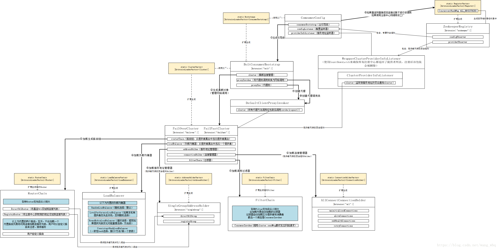

# sofa源码学习

​	要想更好的学习sofa源码，就得对sofa的整个框架体系有一定的了解：



## 服务调用源码

### 例子

​	先举个远程调用的例子，然后再来慢慢说：

* 远程调用要使用的接口

```java
public class HelloSyncServiceImpl implements HelloSyncService {
    @Override
    public String saySync(String msg) {
        System.out.println("Server receive: " + msg);
        return "hello " + msg + " ！";
    }
}
```

* 建立客户端

```java
public class QuickStartServer {
    public static void main(String[] args) {
        ServerConfig serverConfig = new ServerConfig()
                .setProtocol("bolt") // 设置一个协议，默认bolt
                .setPort(12200) // 设置一个端口，默认12200
                .setDaemon(false); // 非守护线程

        ProviderConfig<HelloSyncService> providerConfig = new ProviderConfig<HelloSyncService>()
                .setInterfaceId(HelloSyncService.class.getName()) // 指定接口
                .setRef(new HelloSyncServiceImpl()) // 指定实现
                .setServer(serverConfig); // 指定服务端

        providerConfig.export(); // 发布服务
    }
}
```

* 建立服务端

```java
public class QuickStartClient {
    public static void main(String[] args) {
        ConsumerConfig<HelloSyncService> consumerConfig = new ConsumerConfig<HelloSyncService>()
                .setInterfaceId(HelloSyncService.class.getName()) // 指定接口
                .setProtocol("bolt") // 指定协议
                .setDirectUrl("bolt://127.0.0.1:12200"); // 指定直连地址
        // 生成代理类
        HelloSyncService helloService = consumerConfig.refer();
        while (true) {
            System.out.println(helloService.saySync("world"));
            try {
                Thread.sleep(2000);
            } catch (Exception e) {
            }
        }
    }
}

```

### 远程调用源码

* 服务的入口是：接下来都围绕这个来说

```java
        HelloSyncService helloService = consumerConfig.refer();
```

* 进入以后，发现会先判断是否有消费者启动类（可能先前已经创建过一个了）

```java
    public T refer() {
        if (consumerBootstrap == null) {
            //判断先前有没有创建过服务消费者启动类，没有就创建一个新的
            consumerBootstrap = Bootstraps.from(this);
        }
        return consumerBootstrap.refer();
    }
```

* 因为创建出的启动类也是为了后续使用，所以把创建过程也说一下，不想看的可以直接跳到后面
  * alias – 别名
  * argTypes – 扩展初始化需要的参数类型
  * args – 扩展初始化需要的参数

```java
    public T getExtension(String alias, Class[] argTypes, Object[] args) {
        //使用别名获取扩展类对象，getExtensionClass方法是从map里获取扩展类
        ExtensionClass<T> extensionClass = getExtensionClass(alias);
        //如果扩展类为空，抛出异常
        if (extensionClass == null) {
            throw new SofaRpcRuntimeException("Not found extension of " + interfaceName + " named: \"" + alias + "\"!");
        } else {
        //保证扩展类为单例,并且保证单例工厂不为空，factory是一个map
            if (extensible.singleton() && factory != null) {
                //从单例工厂获取类
                T t = factory.get(alias);
                if (t == null) {//如果查出的结果为空
                    synchronized (this) {//双重校验锁再次确认
                        t = factory.get(alias);
                        if (t == null) {
                            //实例化对象
                            t = extensionClass.getExtInstance(argTypes, args);
                            //将实例化对象放到单例工厂中
                            factory.put(alias, t);
                        }
                    }
                }
                //返回实例对象
                return t;
            } else {//不是单例则直接返回实例(想看后面怎么实现的，可以点进去)
                return extensionClass.getExtInstance(argTypes, args);
            }
        }
    }
```

* 回到原先的refer，ctrl+左键进入


* 重新回到

```java
  public T refer() {
        if (proxyIns != null) {
            //如果代理实现类不为空，则直接返回
            return proxyIns;
        }
        synchronized (this) {
            if (proxyIns != null) {
                //双重锁校验锁二次判断
                return proxyIns;
            }
            //构造key，从调用者的map中取出，构建方式：protocol + "://" + interfaceId + ":" + uniqueId;
            String key = consumerConfig.buildKey();
            //获取应用名称
            String appName = consumerConfig.getAppName();
            // 检查参数
            checkParameters();
            // 提前检查接口类
            if (LOGGER.isInfoEnabled(appName)) {
                LOGGER.infoWithApp(appName, "Refer consumer config : {} with bean id {}", key, consumerConfig.getId());
            }

            // （获取同名配置数量）获取注意同一interface，同一tags，同一protocol情况
            AtomicInteger cnt = REFERRED_KEYS.get(key); // 计数器
            if (cnt == null) { // 没有发布过，就设置上key和默认值
                cnt = CommonUtils.putToConcurrentMap(REFERRED_KEYS, key, new AtomicInteger(0));
            }
            //甚至+1尝试使用
            int c = cnt.incrementAndGet();
            //同一个服务的最大引用次数，防止由于代码bug导致重复引用，每次引用都会生成一个代理类对象，-1表示不检查
            int maxProxyCount = consumerConfig.getRepeatedReferLimit();
            if (maxProxyCount > 0) {
                if (c > maxProxyCount) {
            // 同一个服务的最大引用次数，计数器-1，并抛出异常
                    cnt.decrementAndGet();
                    throw new SofaRpcRuntimeException("Duplicate consumer config with key " + key
                        + " has been referred more than " + maxProxyCount + " times!"
                        + " Maybe it's wrong config, please check it."
                        + " Ignore this if you did that on purpose!");
                } else if (c > 1) {
                    //如果引用服务次数+本次，不超过最大数量
                    if (LOGGER.isInfoEnabled(appName)) {
                        LOGGER.infoWithApp(appName, "Duplicate consumer config with key {} has been referred!"
                            + " Maybe it's wrong config, please check it."
                            + " Ignore this if you did that on purpose!", key);
                    }
                }
            }

            try {
                // build cluster，根据SPI加载配置的路由
                cluster = ClusterFactory.getCluster(this);
                // build listeners，设置监听器，这个作用主要是用来做路由改变时自动更新providerGroup
                consumerConfig.setConfigListener(buildConfigListener(this));
                consumerConfig.setProviderInfoListener(buildProviderInfoListener(this));
                // init cluster，这里加上前面的几步都是用来构建路由，并且设置变化监听
                cluster.init();
                // 构造Invoker对象（执行链）,将代理类调用转换为网络调用
                proxyInvoker = buildClientProxyInvoker(this);
                // 创建代理类
                proxyIns = (T) ProxyFactory.buildProxy(consumerConfig.getProxy(), consumerConfig.getProxyClass(),
                    proxyInvoker);
            } catch (Exception e) {
                if (cluster != null) {
                    cluster.destroy();
                    cluster = null;
                }
                //设置监听器
                consumerConfig.setConfigListener(null);
                consumerConfig.setProviderInfoListener(null);
                cnt.decrementAndGet(); // 发布失败不计数
                if (e instanceof SofaRpcRuntimeException) {
                    throw (SofaRpcRuntimeException) e;
                } else {
                    throw new SofaRpcRuntimeException("Build consumer proxy error!", e);
                }
            }
            if (consumerConfig.getOnAvailable() != null && cluster != null) { //判断配置可用，调用类不为空
                cluster.checkStateChange(false); // 状态变化通知监听器
            }
            //将其加入缓存
            RpcRuntimeContext.cacheConsumerConfig(this);
            //返回代理类实现
            return proxyIns;
        }
    }
```

