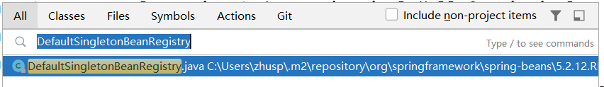
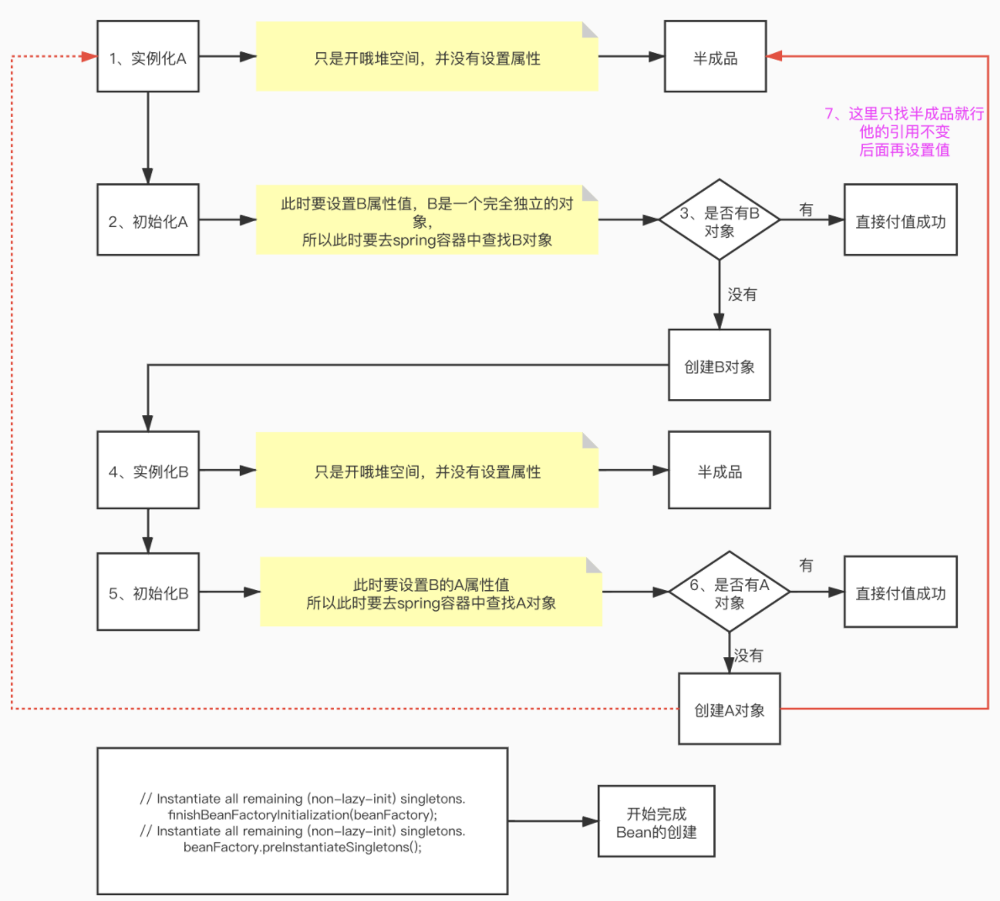
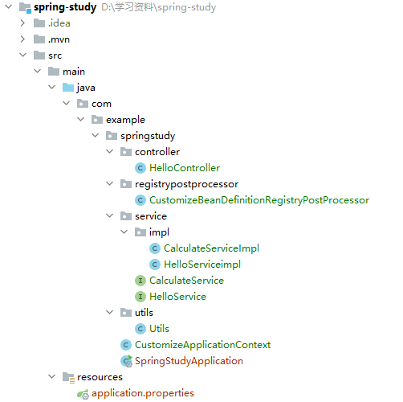

# Spring扩展

​    该笔记用于记载spring的扩展知识，包括循环依赖如何解决，spring存在哪些扩展点，springboot如何运用springboot的扩展点去实现bean的注入，springboot探针应用等。

# Spring源码解析---循环依赖

## 循环依赖

​    本章将通过源码的方式去解释spring是如何解决循环依赖的，可以直接找一个springboot项目或者spring项目，全局搜索即可跟随学习。

* 先做个准备工作，全局搜索（按三下shift）DefaultSingletonBeanRegistry这个类



### 整体思路

spring解决循环依赖问题的主要思路：三级缓存

* Map<String, Object> singletonObjects：一级缓存
* Map<String, Object> earlySingletonObjects：二级缓存
* Map<String, ObjectFactory<?>> singletonFactories：三级缓存

```java
private final Map<String, Object> singletonObjects = new ConcurrentHashMap<>(256);
private final Map<String, ObjectFactory<?>> singletonFactories = new HashMap<>(16);
private final Map<String, Object> earlySingletonObjects = new ConcurrentHashMap<>(16);
```

### set和构造方法

​    spring初始化属性值的方法：set和构造方法

* set方法
* 构造方法（初始化）
* 工厂方法

​    这里只需要说set和构造方法：

* 解决循环依赖的方法：set方法可以解决循环依赖，构造方法不能解决循环依赖。
* 解决方法：
  * set方法：先完成了对象的创建，之后才通过set方法设置属性。
  * 构造方法：创建出对象之后，立即给对象一个属性值
* 解决循环依赖的关键：**把实例化和初始化分开**，先给earlyBean（未设置值）的Bean待用（提前暴露对象），A依赖B，B依赖A，只要有一个依赖一个不完整的Bean就能把环打破，解决循环依赖。

### 结构图

* 先实例化A，但并未放入实例B，此时有两种选择
  * 将实例A放入spring缓存中，供已经初始化完毕的实例B使用（此时A为半成品）
  * 初始化A，此时设置B的属性值，此时又面对两种选择：
    * spring的缓存中有实例B，则直接赋值使用。
    * spring的缓存中没有实例B，创建对象B，实例化B但不设置属性值（不注入A），将半成品的B给到A去使用。

​    总结：getBean--->doGetBean--->createBean--->doCreateBean



### 查看源码

* 回到先前的DefaultSingletonBeanRegistry类，先把之前介绍的三个map记住。
  * Map<String, Object> singletonObjects：一级缓存
  * Map<String, Object> earlySingletonObjects：二级缓存
  * Map<String, ObjectFactory<?>> singletonFactories：三级缓存

​    再记住一点，过程为：getBean--->doGetBean--->createBean--->doCreateBean

* 跟随着上面的过程，先找到getBean这个方法，直接调用了DoGetBean方法
  
  * name：bean的名字

```java
	@Override
	public Object getBean(String name) throws BeansException {
		return doGetBean(name, null, null, false);
	}
```

* 进入doGet方法：从三级缓存中获取bean，接下来部分主要是一个大if，解释清楚这个if就好理解了（解决循环依赖的if）
  * 三级缓存中获取到的bean不为空，且传入的创建bean所需参数为空，返回bean（在这个if中，说明已经解决了循环依赖）
    * 判断是否启用了跟踪弄日志
      * 判断当前bean是否处于正在创建过程中

    * 否则，说明创建完成

  * 三级缓存获取的bean为空，说明此时我们可能存在循环依赖中


```java
	protected <T> T doGetBean(
			String name, @Nullable Class<T> requiredType, @Nullable Object[] args, boolean typeCheckOnly)
			throws BeansException {
		//别名映射
		String beanName = transformedBeanName(name);
		//新建bean对象
        Object bean;
		// Eagerly check singleton cache for manually registered singletons.
        //从一级和二级缓存获取bean，如果没有，则用三级的bean工厂缓存创建，返回bean。（重点！！！）
		Object sharedInstance = getSingleton(beanName);
        //如果bean不为空，且创建bean的参数为空
		if (sharedInstance != null && args == null) {
            //启用了日志跟踪
			if (logger.isTraceEnabled()) {
                //从缓存singletonsCurrentlyInCreation中，获取是否正在创建bean
				if (isSingletonCurrentlyInCreation(beanName)) {
					logger.trace("Returning eagerly cached instance of singleton bean '" + beanName +
							"' that is not fully initialized yet - a consequence of a circular reference");
				}
				else {
					logger.trace("Returning cached instance of singleton bean '" + beanName + "'");
				}
			}
            //获取bean
			bean = getObjectForBeanInstance(sharedInstance, name, beanName, null);
		}
        //三级缓存获取的bean为空，说明此时我们可能存在循环依赖中
		else {
			// Fail if we're already creating this bean instance:
			// We're assumably within a circular reference.
            
            //判断当前创建的bean，和我们要创建的bean是否同名，同名则抛出异常
			if (isPrototypeCurrentlyInCreation(beanName)) {
				throw new BeanCurrentlyInCreationException(beanName);
			}
			// Check if bean definition exists in this factory.
            //获取bean工厂的父类工厂
			BeanFactory parentBeanFactory = getParentBeanFactory();
            //父类工厂不为空且缓存中不包含该类
			if (parentBeanFactory != null && !containsBeanDefinition(beanName)) {
				// Not found -> check parent.
                //确定原始名称，将本地定义名解析成规范名称，&+beanName
				String nameToLookup = originalBeanName(name);
                //如果父工厂类，实现了AbstractBeanFactory类
				if (parentBeanFactory instanceof AbstractBeanFactory) {
					return ((AbstractBeanFactory) parentBeanFactory).doGetBean(
							nameToLookup, requiredType, args, typeCheckOnly);
				}
                //如果bean创建的参数不为空
				else if (args != null) {
					// Delegation to parent with explicit args.
                    //传入bean的名字和创建所需的参数，使用父类的工厂类获取bean
					return (T) parentBeanFactory.getBean(nameToLookup, args);
				}
                //需要检索的bean的类型不为空
				else if (requiredType != null) {
					// No args -> delegate to standard getBean method.
                    //从父类的bean工厂中传入bean的名字和类型进行创建
					return parentBeanFactory.getBean(nameToLookup, requiredType);
				}
				else {
                    //否则，直接传入bean名字创建
					return (T) parentBeanFactory.getBean(nameToLookup);
				}
			}
			//不进行实例检查，并将其标记成已创建
			if (!typeCheckOnly) {
				markBeanAsCreated(beanName);
			}
			//初始化bean的依赖！！涉及递归（重要）
			try {
                //返回该bean的顶级父类
				RootBeanDefinition mbd = getMergedLocalBeanDefinition(beanName);
                //判断该父类是否为Abstract（抽象），否则抛出异常
				checkMergedBeanDefinition(mbd, beanName, args);
				// Guarantee initialization of beans that the current bean depends on.
                //返回这个父类bean所有依赖的bean名称
				String[] dependsOn = mbd.getDependsOn();
				if (dependsOn != null) {
                    //遍历获取到的依赖的bean名称
					for (String dep : dependsOn) {
                        //确定是否为该bean所需的依赖
						if (isDependent(beanName, dep)) {
                            //不是则抛出异常
							throw new BeanCreationException(mbd.getResourceDescription(), beanName,
									"Circular depends-on relationship between '" + beanName + "' and '" + dep + "'");
						}
                        //为给定的bean注册依赖
						registerDependentBean(dep, beanName);
						try {
                            //递归调用bean，使用的方法是doGetBean，也就是本方法
							getBean(dep);
						}
						catch (NoSuchBeanDefinitionException ex) {
							throw new BeanCreationException(mbd.getResourceDescription(), beanName,
									"'" + beanName + "' depends on missing bean '" + dep + "'", ex);
						}
					}
				}

				// Create bean instance.
                //初始化父类依赖所需的bean后，就开始创建自己的bean
                //如果范围为单例（单例：每一次调用都是原本的bean，原型：每一次调用都注入新的bean）
				if (mbd.isSingleton()) {
                    //返回给定的对象，如果没有则new一个
					sharedInstance = getSingleton(beanName, () -> {
						try {
                            //创建 bean 实例、填充 bean 实例、应用后处理器等（重要！）
							return createBean(beanName, mbd, args);
						}
						catch (BeansException ex) {
							// Explicitly remove instance from singleton cache: It might have been put there
							// eagerly by the creation process, to allow for circular reference resolution.
							// Also remove any beans that received a temporary reference to the bean.
                            //如果bean创建出现异常则直接销毁，因为有可能导致循环依赖
							destroySingleton(beanName);
							throw ex;
						}
					});
                    //从缓存中获取已经创建的bean（重要！！）
					bean = getObjectForBeanInstance(sharedInstance, name, beanName, mbd);
				}
                //如果范围为原型（单例：每一次调用都是原本的bean，原型：每一次调用都注入新的bean）
				else if (mbd.isPrototype()) {
					// It's a prototype -> create a new instance.
                    //原型->创建新的实例，初始化新的bean
					Object prototypeInstance = null;
					try {
                        //创建原型之前的回调。默认实现将原型注册为当前正在创建中。
						beforePrototypeCreation(beanName);
                        //创建bean，同上（同上，重要！）
						prototypeInstance = createBean(beanName, mbd, args);
					}
					finally {
                        //创建完毕后，将其移除正在创建的缓存中
						afterPrototypeCreation(beanName);
					}
                    //获取创建完成的bean（同上，重要！）
					bean = getObjectForBeanInstance(prototypeInstance, name, beanName, mbd);
				}
				//如果都不是
				else {
                    //获取范围
					String scopeName = mbd.getScope();
                    //保证不为空，也不为null
					if (!StringUtils.hasLength(scopeName)) {
						throw new IllegalStateException("No scope name defined for bean ´" + beanName + "'");
					}
                    //获取bean的范围
					Scope scope = this.scopes.get(scopeName);
                    //再次保证不为空，否则报错
					if (scope == null) {
						throw new IllegalStateException("No Scope registered for scope name '" + scopeName + "'");
					}
					try {
                        //由于不属于单例也不属于原型，所以按原型处理（同上）
						Object scopedInstance = scope.get(beanName, () -> {
							beforePrototypeCreation(beanName);
							try {
								return createBean(beanName, mbd, args);
							}
							finally {
								afterPrototypeCreation(beanName);
							}
						});
						bean = getObjectForBeanInstance(scopedInstance, name, beanName, mbd);
					}
					catch (IllegalStateException ex) {
						throw new BeanCreationException(beanName,
								"Scope '" + scopeName + "' is not active for the current thread; consider " +
								"defining a scoped proxy for this bean if you intend to refer to it from a singleton",
								ex);
					}
				}
			}
			catch (BeansException ex) {
				cleanupAfterBeanCreationFailure(beanName);
				throw ex;
			}
		}
		
		// Check if required type matches the type of the actual bean instance.
        //检查校验下和原本的bean是否相同
		if (requiredType != null && !requiredType.isInstance(bean)) {
			try {
				T convertedBean = getTypeConverter().convertIfNecessary(bean, requiredType);
				if (convertedBean == null) {
					throw new BeanNotOfRequiredTypeException(name, requiredType, bean.getClass());
				}
				return convertedBean;
			}
			catch (TypeMismatchException ex) {
				if (logger.isTraceEnabled()) {
					logger.trace("Failed to convert bean '" + name + "' to required type '" +
							ClassUtils.getQualifiedName(requiredType) + "'", ex);
				}
				throw new BeanNotOfRequiredTypeException(name, requiredType, bean.getClass());
			}
		}
		return (T) bean;
	}
```

* 先查看getSingleton这个方法：从一级和二级缓存获取bean，如果没有，则用三级的bean工厂缓存创建，返回bean。

```java
    protected Object getSingleton(String beanName, boolean allowEarlyReference) {
        // Quick check for existing instance without full singleton lock
        //先到一级缓存中获取对象
        Object singletonObject = this.singletonObjects.get(beanName);
        //如果一级缓存为空并且没有正在创建的bean（正在创建的bean也有一个map保存）
        if (singletonObject == null && isSingletonCurrentlyInCreation(beanName)) {
            //从二级缓存中获取bean
            singletonObject = this.earlySingletonObjects.get(beanName);
            //如果bean为空，并且允许早起创建引用
            if (singletonObject == null && allowEarlyReference) {
                //上锁
                synchronized (this.singletonObjects) {
                    // Consistent creation of early reference within full singleton lock
                    //重新获取一次一级缓存的bean确保不会重复创建
                    singletonObject = this.singletonObjects.get(beanName);
                    if (singletonObject == null) {
                        //获取二级缓存
                        singletonObject = this.earlySingletonObjects.get(beanName);
                        if (singletonObject == null) {
                            //从三级缓存中获取（bean工厂）
                            ObjectFactory<?> singletonFactory = this.singletonFactories.get(beanName);
                            //如果bean工厂中不为空
                            if (singletonFactory != null) {
                                //从bean工厂中获取对象
                                singletonObject = singletonFactory.getObject();
                                //将bean塞入二级缓存
                                this.earlySingletonObjects.put(beanName, singletonObject);
                                //从三级缓存中删除bean工厂
                                this.singletonFactories.remove(beanName);
                            }
                        }
                    }
                }
            }
        }
        return singletonObject;
    }
```

* 再来看一下重载的方法
  * suppressedExceptions用于获取抑制的异常

```java
    public Object getSingleton(String beanName, ObjectFactory<?> singletonFactory) {
        //保证beanName不为空
        Assert.notNull(beanName, "Bean name must not be null");
        //锁住第一层缓存
        synchronized (this.singletonObjects) {
            //获取对应的bean
            Object singletonObject = this.singletonObjects.get(beanName);
            if (singletonObject == null) {
                //如果bean为空，并且在执行销毁（默认false），则报错
                if (this.singletonsCurrentlyInDestruction) {
                    throw new BeanCreationNotAllowedException(beanName,
                            "Singleton bean creation not allowed while singletons of this factory are in destruction " +
                            "(Do not request a bean from a BeanFactory in a destroy method implementation!)");
                }

                if (logger.isDebugEnabled()) {
                    logger.debug("Creating shared instance of singleton bean '" + beanName + "'");
                }
                //如果不在排除的bean当中，也不在正在生成的bean当中
                beforeSingletonCreation(beanName);
                //一级缓存获取bean失败
                boolean newSingleton = false;
                //suppressedExceptions用于获取抑制的异常，这里表示没有发生过异常是true，否则为true
                boolean recordSuppressedExceptions = (this.suppressedExceptions == null);
                //如果没有发生异常则创建新的set
                if (recordSuppressedExceptions) {
                    this.suppressedExceptions = new LinkedHashSet<>();
                }
                try {
                //从bean工厂中获取bean，可能bean工厂没有，就会被捕获
                    singletonObject = singletonFactory.getObject();
                   //改为获取成功
                    newSingleton = true;
                }
                catch (IllegalStateException ex) {
                    // Has the singleton object implicitly appeared in the meantime ->
                    // if yes, proceed with it since the exception indicates that state.
                    //从一级缓存中再获取
                    singletonObject = this.singletonObjects.get(beanName);
                    //获取为空则抛出异常
                    if (singletonObject == null) {
                        throw ex;
                    }
                }
                catch (BeanCreationException ex) {
                    //没有异常
                    if (recordSuppressedExceptions) {
                        //遍历
                        for (Exception suppressedException : this.suppressedExceptions) {
                            ex.addRelatedCause(suppressedException);
                        }
                    }
                    throw ex;
                }
                finally {
                    //没有异常，就把获取异常的类设置为null
                    if (recordSuppressedExceptions) {
                        this.suppressedExceptions = null;
                    }
                    afterSingletonCreation(beanName);
                }
                if (newSingleton) {
                    addSingleton(beanName, singletonObject);
                }
            }
            return singletonObject;
        }
    }
```

* 来查看一下getObjectForBeanInstance方法：

```java
	protected Object getObjectForBeanInstance(
			Object beanInstance, String name, String beanName, @Nullable RootBeanDefinition mbd) {
		// Don't let calling code try to dereference the factory if the bean isn't a factory.
        //如果是工厂引用（name以&开头）
		if (BeanFactoryUtils.isFactoryDereference(name)) {
            //判断不为空
			if (beanInstance instanceof NullBean) {
				return beanInstance;
			}
            //如果不是工厂类，则抛出异常
			if (!(beanInstance instanceof FactoryBean)) {
				throw new BeanIsNotAFactoryException(beanName, beanInstance.getClass());
			}
            //同事满足mdb不为空和FactoryBean子类，则说明是工厂类
			if (mbd != null) {
				mbd.isFactoryBean = true;
			}
            //返回该类
			return beanInstance;
		}

		// Now we have the bean instance, which may be a normal bean or a FactoryBean.
		// If it's a FactoryBean, we use it to create a bean instance, unless the
		// caller actually wants a reference to the factory.
        
       	//上面说白了，就是把工厂的引用类筛选出去了，下面仅剩下：普通类和工厂类。
        //普通类：直接返回。工厂类：就用工厂创建出我们需要的实体。
        
		if (!(beanInstance instanceof FactoryBean)) {
        //如果不是工厂类，则直接返回
			return beanInstance;
		}
        //初始化一个类
		Object object = null;
		if (mbd != null) {
            //判定当前类为工厂类
			mbd.isFactoryBean = true;
		}
		else {
            //从bean工厂单例对象缓存中，获取指定的bean
			object = getCachedObjectForFactoryBean(beanName);
		}
        //如果获取到的bean为空，说明缓存中没有或为bean工厂
		if (object == null) {
			// Return bean instance from factory.
            //强转为bean工厂
			FactoryBean<?> factory = (FactoryBean<?>) beanInstance;
			// Caches object obtained from FactoryBean if it is a singleton.
			//mdb为空，且存在于bean工厂的缓存中
            if (mbd == null && containsBeanDefinition(beanName)) {
                //获取rootbeanfine
				mbd = getMergedLocalBeanDefinition(beanName);
			}
            //如果 mbd不为空，且mbd是合成的，则为true
			boolean synthetic = (mbd != null && mbd.isSynthetic());
            //从bean工厂获取指定的bean
			object = getObjectFromFactoryBean(factory, beanName, !synthetic);
		}
        //返回bean
		return object;
	}
```

​	至此，spring循环依赖的源码看完了，后续还有很多spring的源码扩展和部分相关知识，我会再分享到平台上以供一起学习。


## springboot扩展

​    spring留下了一些扩展点，我们可以用来做功能拓展，例如AbstractApplicationContext类的initPropertySources、postProcessBeanFactory、onRefresh，在spring-boot里也同样留了这样的扩展点。

* 原本的spring要注入bean，需要在主启动类指定需要解析的bean,解释一下大体意思：
  * 使用ClassPathXmlApplicationContext从指定的xml获取bean的位置
  * 使用context的getbean方法获取xml里对应的实现类，这边如果是其他类就把simple改掉即可

```java
public static void main(String[] args) {
        ClassPathXmlApplicationContext context = new ClassPathXmlApplicationContext("classpath:applicationContext.xml");
        Simple bean = context.getBean(Simple.class);
        bean.execute();
        context.close();
    }
```

* 上面就是最基本的spring使用bean注入的方法，下面来说一说spring boot的bean注入，先来找下springboot留的拓展点。

```java
@SpringBootApplication
public class SpringStudyApplication {
    public static void main(String[] args) {
           //两种启动方式,但第一种较为直白
        //第一种方式
        SpringApplication springApplication = new SpringApplication(SpringStudyApplication.class);
        springApplication.run(args);
        //第二种方式
//        SpringApplication.run(SpringStudyApplication.class, args);
    }
}
```

* 直接进入run方法查看,会看到createApplicationContext方法，这个方法就是用于bean注册的。

```java
    public ConfigurableApplicationContext run(String... args) {
        StopWatch stopWatch = new StopWatch();
        //用于统计事件完成程度的，类似于log日志，start代表开始事件，stoop代表停止
        stopWatch.start();
        ConfigurableApplicationContext context = null;
        Collection<SpringBootExceptionReporter> exceptionReporters = new ArrayList<>();
        configureHeadlessProperty();
        //获取监听器
        SpringApplicationRunListeners listeners = getRunListeners(args);
        //springboot获取并开始监听
        listeners.starting();
        try {
               //准备springboot运行环境
            ApplicationArguments applicationArguments = new DefaultApplicationArguments(args);
            ConfigurableEnvironment environment = prepareEnvironment(listeners, applicationArguments);
            configureIgnoreBeanInfo(environment);
            Banner printedBanner = printBanner(environment);
            //创建ApplicationContext容器（最主要的）
            context = createApplicationContext();
            //创建ApplicationContext容器
            exceptionReporters = getSpringFactoriesInstances(SpringBootExceptionReporter.class,
                    new Class[] { ConfigurableApplicationContext.class }, context);
            //准备容器
            prepareContext(context, environment, listeners, applicationArguments, printedBanner);
            //刷新容器
            refreshContext(context);
            //刷新后的处理
            afterRefresh(context, applicationArguments);

            stopWatch.stop();
            if (this.logStartupInfo) {
                new StartupInfoLogger(this.mainApplicationClass).logStarted(getApplicationLog(), stopWatch);
            }
            listeners.started(context);
            callRunners(context, applicationArguments);
        }
        catch (Throwable ex) {
            handleRunFailure(context, ex, exceptionReporters, listeners);
            throw new IllegalStateException(ex);
        }

        try {
            listeners.running(context);
        }
        catch (Throwable ex) {
            handleRunFailure(context, ex, exceptionReporters, null);
            throw new IllegalStateException(ex);
        }
        return context;
    }
```

* 进入createApplicationContext方法查看：从代码来看，只要刚开始没注入，继承下面三个类中的任一个就可以
  
  * AnnotationConfigServletWebServerApplicationContext：实现这个类仍旧可以启动web应用
  * AnnotationConfigReactiveWebServerApplicationContext：实现这个类后，bean注入是可以的，但报错。需要把onRefresh去除，才能正常运行，但web应用无法启动。
  * AnnotationConfigApplicationContext：实现这个类后，bean注入是可以的，不报错，但web应用仍旧无法启动。
  
  这三个类都实现了AnnotationConfigRegistry接口，同时实现initPropertySources、postProcessBeanFactory、onRefresh三种方法，初始化诶，

```java
protected ConfigurableApplicationContext createApplicationContext() {
    //从applicationContextClass中获取class对象
   Class<?> contextClass = this.applicationContextClass;
    //如果class对象为空为空，就从指定类里面获取
   if (contextClass == null) {
      try {
         switch (this.webApplicationType) {
//org.springframework.boot.web.servlet.context.AnnotationConfigServletWebServerApplicationContext
         case SERVLET:
            contextClass = Class.forName(DEFAULT_SERVLET_WEB_CONTEXT_CLASS);
            break;
//org.springframework.boot.web.reactive.context.AnnotationConfigReactiveWebServerApplicationContext

         case REACTIVE:
            contextClass = Class.forName(DEFAULT_REACTIVE_WEB_CONTEXT_CLASS);
            break;
         default:
//org.springframework.context. annotation.AnnotationConfigApplicationContext
            contextClass = Class.forName(DEFAULT_CONTEXT_CLASS);
         }
      }
      catch (ClassNotFoundException ex) {
         throw new IllegalStateException(
               "Unable create a default ApplicationContext, please specify an ApplicationContextClass", ex);
      }
   }
   return (ConfigurableApplicationContext) BeanUtils.instantiateClass(contextClass);
}
```

### 例子

* 下面举个例子说明，以下是项目结构：



* maven依赖如下：

```xml
<?xml version="1.0" encoding="UTF-8"?>
<project xmlns="http://maven.apache.org/POM/4.0.0" xmlns:xsi="http://www.w3.org/2001/XMLSchema-instance"
    xsi:schemaLocation="http://maven.apache.org/POM/4.0.0 http://maven.apache.org/xsd/maven-4.0.0.xsd">
    <modelVersion>4.0.0</modelVersion>

    <groupId>com.bolingcavalry</groupId>
    <artifactId>customizeapplicationcontext</artifactId>
    <version>0.0.1-SNAPSHOT</version>
    <packaging>jar</packaging>

    <name>customizeapplicationcontext</name>
    <description>Demo project for Spring Boot</description>

    <parent>
        <groupId>org.springframework.boot</groupId>
        <artifactId>spring-boot-starter-parent</artifactId>
        <version>2.0.4.RELEASE</version>
        <relativePath/> <!-- lookup parent from repository -->
    </parent>

    <properties>
        <project.build.sourceEncoding>UTF-8</project.build.sourceEncoding>
        <project.reporting.outputEncoding>UTF-8</project.reporting.outputEncoding>
        <java.version>1.8</java.version>
    </properties>

    <dependencies>
        <dependency>
            <groupId>org.springframework.boot</groupId>
            <artifactId>spring-boot-starter-web</artifactId>
        </dependency>

        <dependency>
            <groupId>org.springframework.boot</groupId>
            <artifactId>spring-boot-starter-test</artifactId>
            <scope>test</scope>
        </dependency>
    </dependencies>

    <build>
        <plugins>
            <plugin>
                <groupId>org.springframework.boot</groupId>
                <artifactId>spring-boot-maven-plugin</artifactId>
            </plugin>
        </plugins>
    </build>
</project>
```

* 要实现的注入bean的位置，需要实现以下三个类的其中一个即可：
  * AnnotationConfigServletWebServerApplicationContext：实现这个类仍旧可以启动web应用
  * AnnotationConfigReactiveWebServerApplicationContext：实现这个类后，bean注入是可以的，但报错。需要把onRefresh去除，才能正常运行，但web应用无法启动。
  * AnnotationConfigApplicationContext：实现这个类后，bean注入是可以的，不报错，但web应用仍旧无法启动。

```java
package com.bolingcavalry.customizeapplicationcontext;

import org.apache.commons.logging.Log;
import org.apache.commons.logging.LogFactory;
import org.springframework.beans.factory.config.ConfigurableListableBeanFactory;
import org.springframework.boot.web.servlet.context.AnnotationConfigServletWebServerApplicationContext;

/**
 * @Description : 自定义的ApplicationContext实现类
 * @Author : zq2599@gmail.com
 * @Date : 2018-08-11 17:12
 */
public class CustomizeApplicationContext extends AnnotationConfigServletWebServerApplicationContext {

    Log logger = LogFactory.getLog(CustomizeApplicationContext.class);

    @Override
    protected void initPropertySources() {
        super.initPropertySources();
        logger.info("execute override initPropertySources");
    }
    @Override
    protected void postProcessBeanFactory(ConfigurableListableBeanFactory beanFactory) {
        super.postProcessBeanFactory(beanFactory);
        logger.info("execute override postProcessBeanFactory");
    }
    @Override
    protected void onRefresh() {
        super.onRefresh();
        logger.info("execute override onRefresh");
    }
}
```

* 修改一下主启动类即可：

```java
package com.bolingcavalry.customizeapplicationcontext;
import org.springframework.boot.SpringApplication;
import org.springframework.boot.autoconfigure.SpringBootApplication;
@SpringBootApplication
public class CustomizeapplicationcontextApplication {
    public static void main(String[] args) {
        SpringApplication springApplication = new SpringApplication(CustomizeapplicationcontextApplication.class);
        springApplication.setApplicationContextClass(CustomizeApplicationContext.class);
        springApplication.run(args);
    }
}
```
